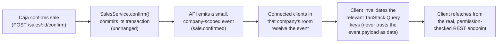

# Desktop / LAN architecture (target direction)

**Status: PROPOSED, not implemented.** This document establishes the
target architecture for moving from "two browser-based apps" to "a
desktop ERP client connected to a local ERP server." Prompt #17
prototypes a limited slice of the visual direction on top of this
document's model; it does not implement desktop packaging, realtime
transport, or LAN discovery — see
[implementation-status.md](implementation-status.md) for what actually
exists in code today.

See also [architecture.md](architecture.md) (current stack/structure),
[desktop-ui-direction.md](desktop-ui-direction.md) (the companion visual
document), and `AGENTS.md`/`CLAUDE.md` for the invariants this document
does not change: one backend, one database, company-scoped data,
permission-based authorization.

## Why this document exists

Today, `apps/gestion` and `apps/facturacion` are two Next.js apps a user
opens in a browser tab, pointed at an API base URL baked in at build time
(`NEXT_PUBLIC_API_URL`, see `apps/gestion/src/lib/api.ts` and
`apps/facturacion/src/lib/auth-client.ts`). That's fine for local
development and demoing on one machine. It is not the target product.

The target: a small business runs **one machine as the ERP server**
(database + API + future realtime transport) and every other PC on the
premises runs an **installed ERP client** that connects to it over the
LAN. This is a fundamentally different deployment shape from "open a
browser, type a URL" — it changes how the client discovers its server,
how sessions behave across origins, and how the UI reacts to a server
that is slow, unreachable, or restarting. Those are the questions this
document answers.

## Components

```
┌─────────────────────────────────────────────────────────────┐
│ ERP SERVER (one machine per business)                        │
│                                                                │
│  ┌──────────────┐   ┌──────────────┐   ┌──────────────────┐  │
│  │  PostgreSQL  │◄──│   apps/api   │──►│  Redis            │  │
│  │ (data of     │   │  (NestJS,    │   │ (not yet on the   │  │
│  │  record)     │   │  modular     │   │  critical path —  │  │
│  └──────────────┘   │  monolith)   │   │  see health.md    │  │
│                      │              │   │  below)           │  │
│                      │  + realtime  │   └──────────────────┘  │
│                      │  transport   │                          │
│                      │  (proposed,  │                          │
│                      │  §Realtime)  │                          │
│                      └──────┬───────┘                          │
│                             │ serves static Gestión/            │
│                             │ Facturación builds too —          │
│                             │ see "Same-origin" below           │
└─────────────────────────────┼───────────────────────────────────┘
                              │  LAN (HTTP, one port)
        ┌─────────────────────┼─────────────────────┐
        │                     │                     │
┌───────▼──────┐      ┌───────▼──────┐      ┌───────▼──────┐
│ ERP CLIENT   │      │ ERP CLIENT   │      │ ERP CLIENT   │
│ (Admin PC)   │      │ (Caja 01)    │      │ (Caja 02)    │
│ Gestión      │      │ Facturación/ │      │ Facturación/ │
│ workspace    │      │ POS workspace│      │ POS workspace│
└──────────────┘      └──────────────┘      └──────────────┘
```

- **ERP Server** — one physical or virtual machine per business,
  hosting PostgreSQL, `apps/api`, and (later) a realtime transport. It
  is also the recommended place to serve the built Gestión/Facturación
  static assets — see "Same-origin serving" below.
- **ERP Client** — one installed desktop application (see
  [desktop-ui-direction.md](desktop-ui-direction.md) and the "Executable
  strategy" in the final report) run on every other PC. It never talks
  to PostgreSQL directly.
- **PostgreSQL** — unchanged from today: the single source of truth,
  reachable only from the API process.
- **API** — unchanged business logic (`apps/api/src/*`), the only
  process allowed to read or write the database.
- **Realtime transport** — proposed, not implemented — see "Realtime
  architecture" below.
- **LAN clients** — any PC on the same local network as the server,
  running the ERP client pointed at the server's address.

**CRITICAL, unchanged from `AGENTS.md`'s architecture invariants:**
client machines never connect to PostgreSQL directly. Every business
operation goes through the API, which independently re-validates
company/branch membership and permissions on every request — the same
rule that already holds for the two browser apps today continues to
hold for the desktop client. Being on the LAN is not a new privilege.

## Deployment example

A small business, one location:

```
ERP-SERVER          192.168.1.50   Postgres + apps/api (+ served frontend)
ADMIN-PC            192.168.1.101  ERP Client → Gestión workspace
CAJA-01             192.168.1.102  ERP Client → Facturación/POS workspace
CAJA-02             192.168.1.103  ERP Client → Facturación/POS workspace
Notebook del dueño   (Wi-Fi, DHCP)  ERP Client → either workspace
```

The server's address is whatever the local network assigns it — a
static LAN IP is the reliable baseline; a `.local` mDNS hostname (e.g.
`erp-servidor.local`) is a nicer-to-type option where the network
supports it (see "Connection configuration"). Nothing in this
architecture assumes a specific IP range, hostname, or number of
client PCs.

## Connection configuration

**No LAN IP is ever hardcoded into the client build.** The client holds
a small, locally persisted "server connection" setting — conceptually:

```
{ "serverUrl": "http://192.168.1.50:3001" }
```

or

```
{ "serverUrl": "http://erp-servidor.local:3001" }
```

- **First run**: the client shows a "Conectar al servidor ERP" screen —
  a single URL field, a "Probar conexión" action that calls the
  server's existing `GET /health` (see `apps/api/src/health`, already
  implemented, zero changes needed) before saving anything, and a clear
  error if the health check fails or times out. Nothing is assumed;
  nothing silently defaults to `localhost`.
- **Storage**: this setting lives outside the web app's own
  `localStorage` (which is per-origin and would need to be re-entered
  every time the configured server changes, since changing `serverUrl`
  effectively changes origin). It belongs in the desktop shell's own
  local config store (e.g., an Electron `userData` JSON file), read
  once at startup before the embedded frontend ever issues a request.
- **Changing servers later**: an explicit "Configuración de conexión"
  screen in the client shell (not a hidden dev setting) lets an admin
  repoint the client — e.g., after replacing the server machine.
- **Discovery**: out of scope for this phase. mDNS/Bonjour-style
  `.local` auto-discovery is a plausible future addition (Windows
  support for `.local` resolution is inconsistent without Bonjour
  installed — a real caveat, not assumed away), but is not implemented
  now; manual entry of an IP or hostname is the baseline that always
  works.

### Same-origin serving (why this matters here, concretely)

`apps/api`'s session cookie is issued with `sameSite: 'lax'`
(`apps/api/src/auth/cookie.util.ts`), and the shared API client sends
every request with `credentials: 'include'`
(`packages/auth-client/src/api-client.ts`). That already works today
because Gestión (`:3000`)/Facturación (`:3002`) and the API (`:3001`)
are all `localhost`, which browsers treat as the same **site** even
across ports — a `Lax` cookie is sent.

A packaged desktop client is a different situation: its frontend is
loaded from an app-internal origin (a custom protocol or a bundled
`file://`/`app://` URL, depending on the desktop technology), which is
**not same-site** with `http://192.168.1.50:3001` at all. A `Lax`
(or even `None`) cookie set by the API would not reliably reach a
cross-site fetch from that origin without extra work (`SameSite=None`
requires `Secure`, i.e. HTTPS, which then requires a trusted certificate
on a plain LAN box — real added complexity for a small-business
on-prem server).

**Recommendation: the ERP Server also serves the built Gestión and
Facturación static output**, on the same host:port the API already
listens on (or one additional port on the same host, still same-site).
The desktop client then simply navigates to
`http://<server>:<port>` — client and API share one origin, the
existing `Lax` cookie flow keeps working exactly as it does today, and
no CORS/cookie policy change is needed anywhere in `apps/api/src/auth`.
This is a deployment/build decision (how the server machine is
provisioned), not a code change to the frontends themselves — noted
here because it directly falls out of inspecting the existing cookie
config, not a generic recommendation.

## Security

- **API authentication is unchanged.** Argon2id passwords, JWT
  access + rotating refresh sessions, password reset, rate limiting,
  security-event logging — all of it stays exactly as documented in
  [implementation-status.md](implementation-status.md)'s "Authentication"
  section. The desktop client authenticates the same way the browser
  apps do today; it does not get a separate, weaker auth path.
- **No direct database access, ever.** Only `apps/api` holds
  `DATABASE_URL`. When the server machine is provisioned for real LAN
  use, PostgreSQL's port should be bound to the server's loopback
  interface only (today's `docker-compose.yml` maps `5433:5432` without
  an explicit bind address, which — depending on the host's Docker/
  firewall defaults — can be reachable from the LAN; this is a
  deployment hardening item for whoever provisions the real server
  machine, not a change to this repository's dev compose file).
- **"Local network" is not "trusted by default."** Every client PC
  still requires a real login; there is no LAN-origin bypass, no
  shared PIN, no implicit trust based on IP range. `RequestContext`
  continues to re-validate company/branch membership and
  `@RequirePermissions()` continues to gate every mutation exactly as
  it does today — physical proximity to the server is never treated as
  an authorization signal.
- **Credentials/session behavior**: unchanged mechanics (cookie-based
  access + refresh, one dedup'd refresh-and-retry on 401 — see
  `packages/auth-client/src/api-client.ts`); the only actual delta this
  document introduces is the same-origin serving recommendation above,
  which exists to *preserve* today's cookie behavior across a LAN
  deployment, not to loosen it.
- **Company isolation remains 100% server-enforced.** Nothing about
  running on a LAN changes the rule that every company-scoped query is
  scoped by the validated `companyId` from `RequestContext` — see
  `AGENTS.md`'s architecture invariants. The client never gets to
  assert which company it may see.

## Failure behavior

The UI must never silently pretend an operation succeeded — this is a
hard requirement, not a nice-to-have, given the previous end-to-end
hardening work already documented in implementation-status.md.

| Situation | Expected UX |
| --- | --- |
| **Server unavailable** (client launched, no server configured or configured server unreachable) | A clear, unmistakable "No se pudo conectar al servidor ERP" state with the configured address shown, a "Reintentar" action, and a path to "Configurar servidor" — never a blank screen, never a spinner that never resolves. |
| **Connection lost mid-session** | The shell's connection indicator (see desktop-ui-direction.md's status bar) flips to a "Sin conexión" state. In-flight and new mutations surface their real failure (`ApiError` already propagates today — nothing new needed there); nothing is queued for silent later retry, since no offline-write queue exists or is proposed here. |
| **Connection restored** | Automatic. The existing `ApiError`/refetch machinery plus TanStack Query's reconnect handling already covers most of this; the shell's status indicator flips back once a health check succeeds, and open screens refetch their visible queries (see "Reconnect behavior" under Realtime). |
| **API starts slowly** (server machine just booted, Postgres still warming up) | `GET /health` already distinguishes exactly this: `status: 'degraded'` when Redis is down but Postgres is up, `status: 'error'` (HTTP 503) when Postgres itself isn't reachable yet (`apps/api/src/health/health.service.ts`). The client shell can poll this endpoint on a light interval and reflect it directly — no backend change required. |
| **Database unavailable** (Postgres down, API process up) | Same `GET /health` response (`status: 'error'`, `services.database: 'error'`) — reused as-is, not re-implemented. |

No fabricated/randomized connection state is used anywhere in the
Prompt #17 prototype — see the "Connection status concept" note in
desktop-ui-direction.md for exactly what was and wasn't built.

## Realtime architecture

**Not implemented in this prompt.** Documented here so the desktop
chrome prototype's connection-status placeholder and the eventual
"data changes on one till show up on another" requirement have a
concrete target to grow into.

### Model



The API remains the **only** authoritative source for reads and writes.
A realtime event is a *hint that something changed*, never the changed
data itself and never trusted as authorization — the client always
re-fetches through the normal, permission-checked REST path. This
mirrors exactly how `AGENTS.md` already insists every company-scoped
read is independently re-validated; a WebSocket event is not exempt
from that rule.

### Event naming and payload philosophy

```
sale.confirmed     { companyId, saleId }
sale.cancelled      { companyId, saleId }
stock.changed        { companyId, warehouseId, productVariantId }
customer.updated     { companyId, customerId }
product.updated      { companyId, productId }
price.changed        { companyId, priceListId, productVariantId }
```

Minimal payload on purpose: an id (or two) and the company scope, never
a full serialized model. This keeps the event shape stable even as the
underlying DTOs evolve, and means the WebSocket layer never has to
reimplement the REST layer's field-level permission gating — the client
still has to go fetch the data through the normal authorized path to
actually see it, so there's nothing sensitive in the event itself.

### Tenant/company isolation

The socket handshake authenticates with the same session the REST API
already trusts (the same cookie, since client and server are
recommended to be same-origin — see "Same-origin serving" above). The
server resolves `companyId` from that authenticated context — never
from a client-supplied value — and joins the socket to a
company-scoped room (`company:{companyId}`) at connect time. Switching
the active company in the UI leaves the old room and joins the new one,
mirroring how TanStack Query cache keys already re-scope by company
(`['company', companyId, ...]`, see CLAUDE.md's cache-isolation rule).

### Reconnect behavior

Rely on the transport's built-in reconnect/backoff (see "Realtime
technology assessment" below) rather than hand-rolling one. On a
successful reconnect, the client performs one broad invalidation of
its currently-mounted queries rather than trying to replay whatever was
missed — see "Missed-event recovery."

### Missed-event recovery

No event log or outbox is proposed. Because events are pure
invalidation hints — never authoritative — a missed event during a
disconnect window is harmless as long as reconnecting triggers a
refetch of whatever is currently on screen. This deliberately avoids
needing a durable event store for this milestone; it can be revisited
if a future requirement needs guaranteed delivery (it shouldn't, given
the invalidate-and-refetch model).

### Why invalidate-and-refetch instead of pushing full models

1. **No duplicated authorization logic.** Pushing a full `SalesDocument`
   over a socket would mean re-implementing the same permission/field
   gating the REST layer already does, a second time, for a second
   transport. Invalidation needs none of that — the refetch goes
   through the exact same guarded endpoint.
2. **No stale-overwrite risk.** A push model risks an out-of-order or
   delayed event overwriting more recent local state. A refetch always
   asks the server for current truth.
3. **Stable payload shape.** An event's shape barely ever needs to
   change (an id and a scope), unlike a full DTO that evolves with the
   product.
4. **Reuses 100% of existing cache-key discipline.** Every
   company-scoped TanStack Query key already exists
   (`['company', companyId, 'sales']`, etc.) — an event just needs to
   map to a key prefix to invalidate, not a new data-fetching pathway.

## Realtime technology assessment

**Recommendation: Socket.IO via NestJS's `@nestjs/websockets` +
`@nestjs/platform-socket.io`.**

Evaluated against this repository specifically:

- **LAN environment** — the usual reasons to reach for SSE or long-poll
  fallbacks (corporate proxies/load balancers that mishandle raw
  WebSockets) mostly don't apply on a small business's own LAN; this
  doesn't rule Socket.IO out, it just means its fallback transport
  isn't the deciding factor either way.
- **NestJS support** — first-class (`@WebSocketGateway()`), and it
  reuses the same guard/DI patterns already used for every other
  `apps/api` module — no bespoke `ws` server bootstrapping to maintain
  alongside Nest's own HTTP server.
- **Reconnect requirements** — Socket.IO's client gives automatic
  reconnect-with-backoff for free; a raw `ws` client would need this
  hand-rolled and tested, for a small team already carrying two
  frontends and one backend.
- **Multi-client / room broadcast** — Socket.IO's room primitive
  (`socket.join('company:xyz')`) is exactly the per-company isolation
  shape "Tenant/company isolation" above needs, with no custom
  broadcast-filtering logic required.
- **Why not raw native WebSocket** — technically sufficient for a
  notify-only event, but every convenience above (reconnect, rooms,
  broad WebView/Electron-Chromium client compatibility) would have to
  be reimplemented by hand; not a good trade for a small team.
- **Why not SSE** — one-directional is fine here (the client never
  needs to push over this channel), but Nest's SSE support has weaker
  room/tenant-scoped broadcast ergonomics than Socket.IO's, and SSE's
  classic advantage (plays nicer with proxies that dislike WebSocket
  upgrades) isn't a real concern on a LAN. No strong reason to prefer
  it here.
- **Future scalability** — a single small-business LAN server handling
  a handful of concurrently connected tills is a trivial load for
  Socket.IO; this is not a decision under internet-scale constraints.

**Current state**: no realtime infrastructure exists in `apps/api`
today — `@nestjs/websockets` appears only as a transitive lockfile
entry, not an actual dependency of `apps/api` or any source file
(verified: not in `apps/api/package.json`, not imported anywhere under
`apps/api/src`). There is nothing to document as "already reusable" —
this would be new infrastructure when it's eventually built.

## Explicitly not part of this phase

Per Prompt #17's scope: no Electron/Tauri dependency added, no
installer, no auto-update, no Windows service, no Docker architecture
change, no WebSocket dependency added, no LAN discovery implementation.
This document exists to establish the target so those can be built
against a decided shape later — see the final report's "Recommendation
for next step."
