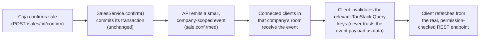

# Desktop / LAN architecture (target direction)

**Status: PROPOSED, not implemented.** This document establishes the
target architecture for moving from "two browser-based apps" to "a
desktop ERP client connected to a local ERP server." Prompt #17
prototypes a limited slice of the visual direction on top of this
document's model; it does not implement desktop packaging, realtime
transport, or LAN discovery — see
[implementation-status.md](implementation-status.md) for what actually
exists in code today.

See also [architecture.md](architecture.md) (current stack/structure),
[desktop-ui-direction.md](desktop-ui-direction.md) (the companion visual
document), and `AGENTS.md`/`CLAUDE.md` for the invariants this document
does not change: one backend, one database, company-scoped data,
permission-based authorization.

## Why this document exists

Today, `apps/gestion` and `apps/facturacion` are two Next.js apps a user
opens in a browser tab, pointed at an API base URL baked in at build time
(`NEXT_PUBLIC_API_URL`, see `apps/gestion/src/lib/api.ts` and
`apps/facturacion/src/lib/auth-client.ts`). That's fine for local
development and demoing on one machine. It is not the target product.

The target: a small business runs **one machine as the ERP server**
(database + API + the Gestión/Facturación UI itself + future realtime
transport) and every other PC on the premises runs a **thin installed
ERP client** that connects to it over the LAN. This is a fundamentally
different deployment shape from "open a browser, type a URL" — it
changes how the client discovers its server, how sessions behave across
origins, and how the UI reacts to a server that is slow, unreachable, or
restarting. Those are the questions this document answers.

## Deployment model (corrected)

**Decision: Electron is a thin desktop shell. Gestión and Facturación
are served by the ERP Server, not bundled into the Electron installer.**
An earlier draft of this document was internally inconsistent — it
described the Electron installer as bundling both frontends' complete
builds in one place, while also recommending the server serve them.
Only one of those is the target; this section is the correction.

```
ERP SERVER                              ERP CLIENT (Electron)
────────────────────────────────────    ──────────────────────────
PostgreSQL                              Thin shell only:
NestJS API                                - local server configuration
Gestión frontend  (Next.js process)       - server health/connect screen
Facturación frontend (Next.js process)    - workspace selection (Gestión/
future Socket.IO                            Facturación) — a BrowserWindow
                                              navigating to the ERP
                                              Server's own URL for that
                                              workspace, not a locally
                                              bundled copy of the app
                                           - native integrations later
                                             (printing, barcode focus
                                             behavior — already works via
                                             plain keyboard input, see
                                             pos.md)
```

Why this matters: it gives **central UI deployment** — updating the ERP
Server's Gestión/Facturación build once updates every connected LAN
client immediately, the same day, with no per-PC reinstall. An Electron
installer that bundled the full frontend builds would instead need a
new installer pushed to every till whenever the UI changes, which
defeats one of the main reasons to centralize on a server in the first
place. The Electron shell's own release cadence (the thin shell itself:
connection screen, workspace switcher chrome, native integrations)
is expected to be much slower than the server-hosted UI's.

## Components

```
┌───────────────────────────────────────────────────────────────┐
│ ERP SERVER (one machine per business)                          │
│                                                                  │
│  ┌──────────────┐  ┌──────────────┐  ┌───────────┐ ┌─────────┐ │
│  │  PostgreSQL  │◄─│   apps/api   │  │  Gestión  │ │Facturac.│ │
│  │ (data of     │  │  (NestJS,    │  │ (Next.js  │ │(Next.js │ │
│  │  record)     │  │  modular     │  │  server   │ │ server  │ │
│  └──────────────┘  │  monolith)   │  │  process) │ │ process)│ │
│                     │              │  └───────────┘ └─────────┘ │
│                     │  + realtime  │   own origin    own origin │
│                     │  transport   │   (own port —   (own port — │
│                     │  (proposed,  │   see "Origins, │ see below)│
│                     │  §Realtime)  │   cookies, CORS"│           │
│                     └──────┬───────┘   below)                   │
└────────────────────────────┼─────────────────────────────────────┘
                              │  LAN (HTTP — see "LAN / TLS" below)
        ┌─────────────────────┼─────────────────────┐
        │                     │                     │
┌───────▼──────┐      ┌───────▼──────┐      ┌───────▼──────┐
│ ERP CLIENT   │      │ ERP CLIENT   │      │ ERP CLIENT   │
│ (Admin PC)   │      │ (Caja 01)    │      │ (Caja 02)    │
│ thin Electron│      │ thin Electron│      │ thin Electron│
│ shell →      │      │ shell →      │      │ shell →      │
│ navigates to │      │ navigates to │      │ navigates to │
│ server's own │      │ server's own │      │ server's own │
│ Gestión URL  │      │ Facturación/ │      │ Facturación/ │
│              │      │ POS URL      │      │ POS URL      │
└──────────────┘      └──────────────┘      └──────────────┘
```

- **ERP Server** — one physical or virtual machine per business,
  hosting PostgreSQL, `apps/api`, and both the Gestión and Facturación
  Next.js server processes — see "Next.js hosting" below for exactly
  what that means with today's codebase, and "Deployment model
  (corrected)" above for why the frontends live here, not inside the
  Electron installer.
- **ERP Client** — a thin Electron shell (see
  [desktop-ui-direction.md](desktop-ui-direction.md) and the
  "Deployment model" section above) run on every other PC. It holds
  local server configuration and a workspace selector, then navigates
  to the ERP Server's own Gestión/Facturación URL for that workspace —
  it does not bundle a local copy of either app. It never talks to
  PostgreSQL directly.
- **PostgreSQL** — unchanged from today: the single source of truth,
  reachable only from the API process.
- **API** — unchanged business logic (`apps/api/src/*`), the only
  process allowed to read or write the database.
- **Realtime transport** — proposed, not implemented — see "Realtime
  architecture" below.
- **LAN clients** — any PC on the same local network as the server,
  running the thin ERP client pointed at the server's address.

**CRITICAL, unchanged from `AGENTS.md`'s architecture invariants:**
client machines never connect to PostgreSQL directly. Every business
operation goes through the API, which independently re-validates
company/branch membership and permissions on every request — the same
rule that already holds for the two browser apps today continues to
hold for the desktop client. Being on the LAN is not a new privilege.

## Next.js hosting: current reality, not assumed

Inspected directly, not assumed: neither `apps/gestion/next.config.ts`
nor `apps/facturacion/next.config.ts` sets `output: 'export'` or
`output: 'standalone'` — both are the default Next.js config. Both
apps' production builds contain dynamic, server-rendered routes (e.g.
`/ventas/[id]`, `/productos/[id]`, `/administracion/roles/[id]` — shown
as `ƒ` "server-rendered on demand" in `next build`'s own route table,
confirmed by running the build). Neither app defines
`generateStaticParams` for these routes. **A static export is not what
these apps produce today, and this PR does not change that.**

Both apps already ship a real `start` script (`next start`, see
`apps/gestion/package.json`/`apps/facturacion/package.json`) — the same
command already used implicitly whenever someone runs a production
Next.js deployment. So the realistic initial ERP Server deployment
shape is:

**Option A — two long-running Next.js server (Node) processes**, one
per app, each on its own port (mirroring today's dev setup: Gestión on
`:3000`, Facturación on `:3002`, API on `:3001`), started with
`next build && next start` and kept running by whatever process
supervisor the server machine uses (a Windows service, `pm2`, etc. —
not decided here, out of scope for this PR).

This is documented as the current-reality baseline, not implemented as
new infrastructure in this PR — no `next.config.ts` changes, no new
scripts. Converting either app to a static export (Option B) would
require adding `generateStaticParams` (or removing the dynamic-id
routes' server dependency) for every dynamic route first, which is a
real, separate piece of work, not attempted here. A reverse-proxied
single-origin deployment (Option C) is discussed as a future option
under "Origins, cookies, and CORS" below — also not implemented.

## Deployment example

A small business, one location:

```
ERP-SERVER          192.168.1.50   Postgres, apps/api (:3001),
                                    Gestión (:3000), Facturación (:3002)
ADMIN-PC            192.168.1.101  ERP Client → Gestión workspace
CAJA-01             192.168.1.102  ERP Client → Facturación/POS workspace
CAJA-02             192.168.1.103  ERP Client → Facturación/POS workspace
Notebook del dueño   (Wi-Fi, DHCP)  ERP Client → either workspace
```

The server's address is whatever the local network assigns it — a
static LAN IP is the reliable baseline; a `.local` mDNS hostname (e.g.
`erp-servidor.local`) is a nicer-to-type option where the network
supports it (see "Connection configuration"). Nothing in this
architecture assumes a specific IP range, hostname, or number of
client PCs. The specific ports shown (`:3000`/`:3001`/`:3002`) are
today's dev defaults, carried through as an illustration — a real
deployment can reassign them; what matters is that they remain three
distinct origins unless the future reverse-proxy option below is
adopted.

## Connection configuration

**No LAN IP is ever hardcoded into the client build.** The client holds
a small, locally persisted "server connection" setting — conceptually
just the server's host, not a specific app's port, since the shell
needs to reach all three server-hosted processes (API, Gestión,
Facturación):

```
{ "serverHost": "192.168.1.50" }
```

or

```
{ "serverHost": "erp-servidor.local" }
```

- **First run**: the client shows a "Conectar al servidor ERP" screen —
  a single URL field, a "Probar conexión" action that calls the
  server's existing `GET /health` (see `apps/api/src/health`, already
  implemented, zero changes needed) before saving anything, and a clear
  error if the health check fails or times out. Nothing is assumed;
  nothing silently defaults to `localhost`.
- **Storage**: this setting lives outside the web app's own
  `localStorage` (which is per-origin and would need to be re-entered
  every time the configured server changes, since changing `serverUrl`
  effectively changes origin). It belongs in the desktop shell's own
  local config store (e.g., an Electron `userData` JSON file), read
  once at startup before the embedded frontend ever issues a request.
- **Changing servers later**: an explicit "Configuración de conexión"
  screen in the client shell (not a hidden dev setting) lets an admin
  repoint the client — e.g., after replacing the server machine.
- **Discovery**: out of scope for this phase. mDNS/Bonjour-style
  `.local` auto-discovery is a plausible future addition (Windows
  support for `.local` resolution is inconsistent without Bonjour
  installed — a real caveat, not assumed away), but is not implemented
  now; manual entry of an IP or hostname is the baseline that always
  works.

### Runtime server configuration (future Electron shell, not built yet)

This PR's prototype workspace switcher (`apps/gestion/src/components/layout/workspace-switcher.tsx`,
`apps/facturacion/.../workspace-switcher.tsx`) links to the other app
via a **build-time** environment variable —
`NEXT_PUBLIC_FACTURACION_URL`/`NEXT_PUBLIC_GESTION_URL`, falling back to
the dev ports. **This is explicitly prototype/dev behavior, not the
target LAN configuration mechanism** — it requires rebuilding the app
to point at a different address, which is exactly what the target
architecture must avoid: one customer's install must never require a
different build than another's.

The target: the future Electron shell reads its persisted `serverHost`
(above) at startup and **derives** each workspace's URL from it at
runtime — e.g. `http://{serverHost}:3000` for Gestión,
`http://{serverHost}:3002` for Facturación, `http://{serverHost}:3001`
for the API — the same three-port shape "Origins, cookies, and CORS"
below documents, just parameterized by the one value the operator
entered on the connect screen instead of baked into the bundle. If the
future reverse-proxy option (see below) is adopted instead, the shell
would derive path-based URLs under one origin the same way. Neither is
implemented in this PR — the prototype's `NEXT_PUBLIC_*` variables
remain acceptable for local dev and for demoing the visual direction,
and should be replaced by this runtime mechanism when the actual
Electron shell is built.

### Origins, cookies, and CORS (corrected terminology)

Two different browser concepts were conflated in an earlier draft of
this document. Stated precisely, because the distinction actually
matters for how this gets deployed:

- **Site** (what `SameSite` cookies care about) is the registrable
  domain — scheme + eTLD+1 — and **ignores port**.
  `http://erp-server:3000`, `http://erp-server:3001`, and
  `http://erp-server:3002` are all the same site.
- **Origin** (what CORS cares about) is scheme + host + **port**.
  Those same three URLs are **three different origins**, full stop —
  differing only by port is enough to make them cross-origin.

`apps/api`'s session cookie is issued with `sameSite: 'lax'`
(`apps/api/src/auth/cookie.util.ts`), and the shared API client sends
every request with `credentials: 'include'`
(`packages/auth-client/src/api-client.ts`). That's why the cookie
itself already flows correctly between Gestión (`:3000`)/Facturación
(`:3002`) and the API (`:3001`) today, on `localhost` and equally on a
LAN hostname/IP — **same-site is a port-independent property**, so
nothing about a LAN deployment changes it.

**But `SameSite` says nothing about CORS.** They're independent browser
mechanisms: `SameSite` governs whether a cookie is *attached* to a
request; CORS governs whether the browser lets the calling page's
script *make and read* a cross-origin request at all. Since Gestión
(`:3000`), Facturación (`:3002`), and the API (`:3001`) are different
origins even though they're the same site, the API's existing CORS
allow-list is genuinely load-bearing, not incidental:

```
CORS_ORIGIN: z.string().default('http://localhost:3000,http://localhost:3002')
```

(`packages/config/src/env.ts`, mirrored in `apps/api/.env`, consumed by
`app.enableCors({ origin: allowedOrigins, credentials: true })` in
`apps/api/src/main.ts`). **This document's earlier claim that same-port
ambiguity could be waved away as "same-origin" was wrong — CORS remains
in the picture for the current three-port shape, on a LAN exactly as it
does today on localhost.** For a real LAN deployment, `CORS_ORIGIN` must
list the server's actual reachable frontend origins (e.g.
`http://192.168.1.50:3000,http://192.168.1.50:3002`, or the `.local`
hostname equivalent) — not `localhost` — the same allow-list mechanism
that already exists, just pointed at the deployment's real addresses.
This is a configuration value change at deploy time, not a code change.

Since the corrected deployment model (see above) has the Electron shell
navigate directly to the ERP Server's own Gestión/Facturación URLs
rather than loading a bundled frontend from an app-internal protocol,
the browser context inside Electron's window is in exactly the same
same-site-but-cross-origin situation as a regular browser hitting the
server today — no new cookie/CORS problem is introduced by packaging,
and none of today's cookie/CORS configuration needs to change for the
Electron shell specifically.

**Future option, not implemented:** a reverse proxy in front of the
three processes (e.g. path-based routing — `/api/*` → `apps/api`, `/` →
Gestión, `/facturacion/*` → Facturación — all under one externally
visible port) would collapse three origins into one, eliminating the
CORS allow-list requirement entirely for browser/Electron clients. This
is a plausible later deployment simplification, explicitly **not**
adopted or implemented in this PR — the current three-origin,
CORS-allow-listed shape is what's documented as the near-term target.

## Security

- **API authentication is unchanged.** Argon2id passwords, JWT
  access + rotating refresh sessions, password reset, rate limiting,
  security-event logging — all of it stays exactly as documented in
  [implementation-status.md](implementation-status.md)'s "Authentication"
  section. The desktop client authenticates the same way the browser
  apps do today; it does not get a separate, weaker auth path.
- **No direct database access, ever.** Only `apps/api` holds
  `DATABASE_URL`. When the server machine is provisioned for real LAN
  use, PostgreSQL's port should be bound to the server's loopback
  interface only (today's `docker-compose.yml` maps `5433:5432` without
  an explicit bind address, which — depending on the host's Docker/
  firewall defaults — can be reachable from the LAN; this is a
  deployment hardening item for whoever provisions the real server
  machine, not a change to this repository's dev compose file).
- **"Local network" is not "trusted by default."** Every client PC
  still requires a real login; there is no LAN-origin bypass, no
  shared PIN, no implicit trust based on IP range. `RequestContext`
  continues to re-validate company/branch membership and
  `@RequirePermissions()` continues to gate every mutation exactly as
  it does today — physical proximity to the server is never treated as
  an authorization signal.
- **Credentials/session behavior**: unchanged mechanics (cookie-based
  access + refresh, one dedup'd refresh-and-retry on 401 — see
  `packages/auth-client/src/api-client.ts`). Nothing about this PR
  changes the cookie policy itself — see "Origins, cookies, and CORS"
  above for why the existing `SameSite: 'lax'` + CORS-allow-list
  combination already covers the three-origin LAN shape without any
  code change.
- **Company isolation remains 100% server-enforced.** Nothing about
  running on a LAN changes the rule that every company-scoped query is
  scoped by the validated `companyId` from `RequestContext` — see
  `AGENTS.md`'s architecture invariants. The client never gets to
  assert which company it may see.

## LAN / TLS security posture

The examples throughout this document use plain `http://` (e.g.
`http://192.168.1.50`). That tradeoff deserves stating explicitly
rather than leaving it implicit:

- **Plain HTTP over the LAN may be acceptable for development and a
  controlled pilot deployment** (a single trusted small-business
  network, evaluated with the customer), but it is not a production
  security posture by default.
- **"Not trusted by default" (see above) is about authorization, not
  transport.** Every request is still authenticated and permission-
  checked even over plain HTTP — but plain HTTP itself provides **no
  transport encryption**. Login credentials and the session cookie
  travel in clear text on the LAN segment; anyone who can observe that
  network traffic (a compromised device on the same Wi-Fi, a hostile
  actor with physical network access) can read them. This is a real gap
  a LAN's physical boundary does not close by itself.
- **`AUTH_COOKIE_SECURE` (`apps/api/src/auth/cookie.util.ts`) is the
  concrete lever**: the `Secure` cookie attribute only makes sense over
  HTTPS — running the server on plain HTTP means this stays `false`
  today, which is consistent with development but is exactly the
  setting a production customer deployment needs to revisit once TLS is
  in place.
- **A real customer deployment must make an explicit transport-security
  decision** before going into production use with real business data —
  this document does not make that decision or implement it. Plausible
  future options: TLS termination at the ERP Server itself with a
  locally-trusted certificate (a small internal CA the deployment
  provisions, since a small business's LAN hostname/IP won't have a
  publicly-trusted certificate), or TLS termination at a reverse proxy
  (the same component discussed as a future option under "Origins,
  cookies, and CORS" could also be the natural place to terminate TLS).
- **Do not present plain LAN HTTP as if it were already secure.** It
  satisfies "the client only talks to the API, never the database" and
  "every request is authorized," but it explicitly does **not**
  satisfy "traffic is encrypted in transit" — those are different
  properties, and this document treats them as such rather than
  implying HTTP-over-LAN is a finished security story.

## Failure behavior

The UI must never silently pretend an operation succeeded — this is a
hard requirement, not a nice-to-have, given the previous end-to-end
hardening work already documented in implementation-status.md.

| Situation | Expected UX |
| --- | --- |
| **First load / not yet known** (the very first health check hasn't resolved yet) | A neutral, low-emphasis **"checking"** state ("Comprobando servidor…") — deliberately distinct from "disconnected," so a normal page load never flashes a false "Sin conexión" before the first check has had a chance to answer. Implemented in this PR — see `apps/gestion/src/lib/use-server-health.ts`. |
| **Server unavailable** (client launched, no server configured or configured server unreachable) | A clear, unmistakable "No se pudo conectar al servidor ERP" state with the configured address shown, a "Reintentar" action, and a path to "Configurar servidor" — never a blank screen, never a spinner that never resolves. |
| **Connection lost mid-session** | The shell's connection indicator (see desktop-ui-direction.md's status bar) flips to a "Sin conexión" state — never back to "checking," since a real prior result is already known (see `use-server-health.ts`'s comments). In-flight and new mutations surface their real failure (`ApiError` already propagates today — nothing new needed there); nothing is queued for silent later retry, since no offline-write queue exists or is proposed here. |
| **Connection restored** | Automatic. The existing `ApiError`/refetch machinery plus TanStack Query's reconnect handling already covers most of this; the shell's status indicator flips back to "Conectado" once a health check succeeds, and open screens refetch their visible queries (see "Reconnect behavior" under Realtime). |
| **API starts slowly** (server machine just booted, Postgres still warming up) | `GET /health` already distinguishes exactly this: `status: 'degraded'` when Redis is down but Postgres is up, `status: 'error'` (HTTP 503) when Postgres itself isn't reachable yet (`apps/api/src/health/health.service.ts`). The client shell can poll this endpoint on a light interval and reflect it directly — no backend change required. |
| **Database unavailable** (Postgres down, API process up) | Same `GET /health` response (`status: 'error'`, `services.database: 'error'`) — reused as-is, not re-implemented. |

No fabricated/randomized connection state is used anywhere in the
Prompt #17 prototype — see the "Connection status concept" note in
desktop-ui-direction.md for exactly what was and wasn't built.

## Realtime architecture

**Not implemented in this prompt.** Documented here so the desktop
chrome prototype's connection-status placeholder and the eventual
"data changes on one till show up on another" requirement have a
concrete target to grow into.

### Model



The API remains the **only** authoritative source for reads and writes.
A realtime event is a *hint that something changed*, never the changed
data itself and never trusted as authorization — the client always
re-fetches through the normal, permission-checked REST path. This
mirrors exactly how `AGENTS.md` already insists every company-scoped
read is independently re-validated; a WebSocket event is not exempt
from that rule.

### Event naming and payload philosophy

```
sale.confirmed     { companyId, saleId }
sale.cancelled      { companyId, saleId }
stock.changed        { companyId, warehouseId, productVariantId }
customer.updated     { companyId, customerId }
product.updated      { companyId, productId }
price.changed        { companyId, priceListId, productVariantId }
```

Minimal payload on purpose: an id (or two) and the company scope, never
a full serialized model. This keeps the event shape stable even as the
underlying DTOs evolve, and means the WebSocket layer never has to
reimplement the REST layer's field-level permission gating — the client
still has to go fetch the data through the normal authorized path to
actually see it, so there's nothing sensitive in the event itself.

### Tenant/company isolation

The socket handshake authenticates with the same session the REST API
already trusts (the same cookie — Socket.IO's handshake carries it the
same way any same-site request does, per "Origins, cookies, and CORS"
above; the socket server would need the same CORS-origin allow-list
treatment as `apps/api/src/main.ts`'s HTTP CORS config). The server
resolves `companyId` from that authenticated context — never
from a client-supplied value — and joins the socket to a
company-scoped room (`company:{companyId}`) at connect time. Switching
the active company in the UI leaves the old room and joins the new one,
mirroring how TanStack Query cache keys already re-scope by company
(`['company', companyId, ...]`, see CLAUDE.md's cache-isolation rule).

### Reconnect behavior

Rely on the transport's built-in reconnect/backoff (see "Realtime
technology assessment" below) rather than hand-rolling one. On a
successful reconnect, the client performs one broad invalidation of
its currently-mounted queries rather than trying to replay whatever was
missed — see "Missed-event recovery."

### Missed-event recovery

No event log or outbox is proposed. Because events are pure
invalidation hints — never authoritative — a missed event during a
disconnect window is harmless as long as reconnecting triggers a
refetch of whatever is currently on screen. This deliberately avoids
needing a durable event store for this milestone; it can be revisited
if a future requirement needs guaranteed delivery (it shouldn't, given
the invalidate-and-refetch model).

### Why invalidate-and-refetch instead of pushing full models

1. **No duplicated authorization logic.** Pushing a full `SalesDocument`
   over a socket would mean re-implementing the same permission/field
   gating the REST layer already does, a second time, for a second
   transport. Invalidation needs none of that — the refetch goes
   through the exact same guarded endpoint.
2. **No stale-overwrite risk.** A push model risks an out-of-order or
   delayed event overwriting more recent local state. A refetch always
   asks the server for current truth.
3. **Stable payload shape.** An event's shape barely ever needs to
   change (an id and a scope), unlike a full DTO that evolves with the
   product.
4. **Reuses 100% of existing cache-key discipline.** Every
   company-scoped TanStack Query key already exists
   (`['company', companyId, 'sales']`, etc.) — an event just needs to
   map to a key prefix to invalidate, not a new data-fetching pathway.

## Realtime technology assessment

**Recommendation: Socket.IO via NestJS's `@nestjs/websockets` +
`@nestjs/platform-socket.io`.**

Evaluated against this repository specifically:

- **LAN environment** — the usual reasons to reach for SSE or long-poll
  fallbacks (corporate proxies/load balancers that mishandle raw
  WebSockets) mostly don't apply on a small business's own LAN; this
  doesn't rule Socket.IO out, it just means its fallback transport
  isn't the deciding factor either way.
- **NestJS support** — first-class (`@WebSocketGateway()`), and it
  reuses the same guard/DI patterns already used for every other
  `apps/api` module — no bespoke `ws` server bootstrapping to maintain
  alongside Nest's own HTTP server.
- **Reconnect requirements** — Socket.IO's client gives automatic
  reconnect-with-backoff for free; a raw `ws` client would need this
  hand-rolled and tested, for a small team already carrying two
  frontends and one backend.
- **Multi-client / room broadcast** — Socket.IO's room primitive
  (`socket.join('company:xyz')`) is exactly the per-company isolation
  shape "Tenant/company isolation" above needs, with no custom
  broadcast-filtering logic required.
- **Why not raw native WebSocket** — technically sufficient for a
  notify-only event, but every convenience above (reconnect, rooms,
  broad WebView/Electron-Chromium client compatibility) would have to
  be reimplemented by hand; not a good trade for a small team.
- **Why not SSE** — one-directional is fine here (the client never
  needs to push over this channel), but Nest's SSE support has weaker
  room/tenant-scoped broadcast ergonomics than Socket.IO's, and SSE's
  classic advantage (plays nicer with proxies that dislike WebSocket
  upgrades) isn't a real concern on a LAN. No strong reason to prefer
  it here.
- **Future scalability** — a single small-business LAN server handling
  a handful of concurrently connected tills is a trivial load for
  Socket.IO; this is not a decision under internet-scale constraints.

**Current state**: no realtime infrastructure exists in `apps/api`
today — `@nestjs/websockets` appears only as a transitive lockfile
entry, not an actual dependency of `apps/api` or any source file
(verified: not in `apps/api/package.json`, not imported anywhere under
`apps/api/src`). There is nothing to document as "already reusable" —
this would be new infrastructure when it's eventually built.

## Explicitly not part of this phase

Per Prompt #17's scope: no Electron/Tauri dependency added, no
installer, no auto-update, no Windows service, no Docker architecture
change, no WebSocket dependency added, no LAN discovery implementation.
This document exists to establish the target so those can be built
against a decided shape later — see the final report's "Recommendation
for next step."
