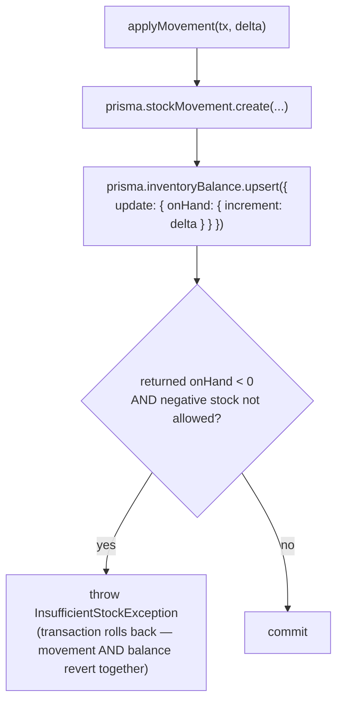
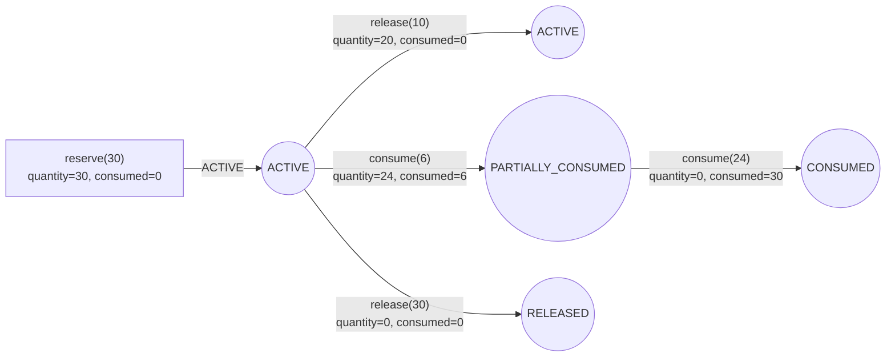
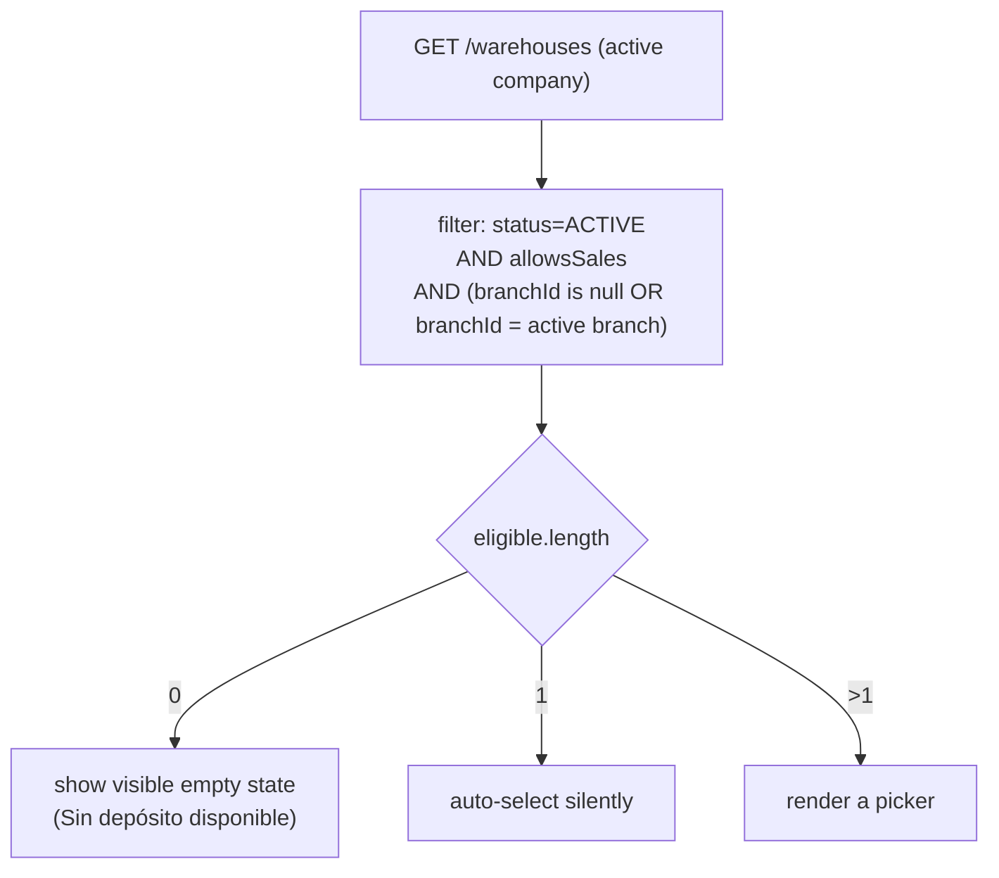

# Inventory (warehouses, stock ledger, adjustments)

This document covers the inventory foundation: `Warehouse`, the
`StockMovement` ledger, the `InventoryBalance` projection,
`StockReservation`, and `StockAdjustment`. Read this before touching
`apps/api/src/inventory`, `apps/api/src/warehouses`, or Gestión's `/stock`.

See also [products.md](products.md) (Product/ProductVariant own catalog
identity; Inventory owns quantity), [authorization.md](authorization.md)
(the `inventory.*` permissions), [audit-architecture.md](audit-architecture.md)
(how warehouse/adjustment mutations are audited), and the root
[CLAUDE.md](../CLAUDE.md) for the permanent rules extracted from this doc.

## What this module is — and isn't

Inventory answers **how much of something is where, right now, and why**.
It does not answer what the item is (`Product`/`ProductVariant`, see
products.md), what it costs, or what it sells for (future Price
List/valuation modules). It also does not yet answer *who bought it* or
*who supplied it* — Sales, Purchases, Delivery Notes, and POS are all
future consumers of this foundation, not part of it (see "Deferred").

The central design decision, stated once so every other section can rely
on it:

> **`StockMovement` is the only authoritative source of physical
> inventory. `InventoryBalance` is a derived, rebuildable projection.**

Nothing in this codebase is allowed to write a stock quantity any other
way — not `Product.stock -= x`, not a raw `InventoryBalance` insert
outside `InventoryService`, not a seed script bypassing the ledger logic.

## Core quantities

```
ON_HAND    = sum of confirmed StockMovement.quantity for a
             (companyId, warehouseId, productVariantId)
RESERVED   = sum of active/partially-consumed StockReservation.quantity
             for the same key
AVAILABLE  = ON_HAND - RESERVED
INCOMING   = future purchase/transfer-in-transit integration — always
             exposed as 0 today. Never fabricated, never estimated.
```

`InventoryBalance` caches all four so reads don't re-sum the ledger every
time, but the formulas above are the ground truth. If a bug ever makes the
cache disagree with the ledger, the ledger is correct and the cache is
wrong — see "Rebuilding" below.

## Warehouse

`Warehouse` belongs to exactly one `Company` and, optionally, one
`Branch` (`branchId` nullable — a warehouse doesn't have to be tied to a
specific branch, and a branch can have zero, one, or several warehouses;
never assume `branch === warehouse` anywhere, including in Facturación —
see "Facturación" below).

```
code                unique per company
name, description
allowsSales         may be selected as a sale/dispatch source
allowsPurchases      may be selected as a purchase/receipt destination
allowNegativeStock   see "Negative stock policy"
status               ACTIVE | INACTIVE
```

Never physically deleted — `deactivate`/`reactivate` flip `status`, same
pattern as `Product`/`Customer`. Deactivation is **rejected** if either is
still true for the warehouse:

- Any variant's `InventoryBalance.onHand != 0` in that warehouse
  (`WAREHOUSE_HAS_STOCK`) — a warehouse with physical stock can never be
  hidden from view.
- Any `StockReservation` in `ACTIVE`/`PARTIALLY_CONSUMED` status still
  references it (`WAREHOUSE_HAS_ACTIVE_RESERVATIONS`).

## StockMovement — the ledger

```
MovementType: INITIAL_BALANCE | ADJUSTMENT_IN | ADJUSTMENT_OUT |
              TRANSFER_IN | TRANSFER_OUT | PURCHASE | PURCHASE_RETURN |
              SALE | SALE_RETURN | DELIVERY |
              PRODUCTION_IN | PRODUCTION_OUT
```

Only `INITIAL_BALANCE`, `ADJUSTMENT_IN`, and `ADJUSTMENT_OUT` are actually
generated by this task — the rest exist as stable, reserved values so
future Sales/Purchases/Transfers/Manufacturing modules never have to add
a migration just to record a movement type; they only have to start
calling `InventoryService`.

`quantity` is `NUMERIC(19,6)` (never a JS `number`/float) and **signed** —
the direction is implied by `MovementType`, not left to the caller:

```
MOVEMENT_TYPE_SIGN: +1 → INITIAL_BALANCE, ADJUSTMENT_IN, TRANSFER_IN,
                          PURCHASE, SALE_RETURN, PRODUCTION_IN
                    -1 → ADJUSTMENT_OUT, TRANSFER_OUT, PURCHASE_RETURN,
                          SALE, DELIVERY, PRODUCTION_OUT
```

The service derives `movementType` from a caller-supplied signed delta
(e.g. an adjustment line) and independently validates that a caller who
already knows the type supplies a quantity with the matching sign —
`quantity` is **never trusted from a client payload directly**. Quantity
must never be zero.

**Immutable.** No controller exposes `PATCH`/`DELETE` for `StockMovement`,
and none ever should. A wrong movement is corrected with a new, opposite
movement (or a corrective adjustment) — never edited or deleted. There is
also no generic public `POST /inventory/movements` — a client can never
insert a raw, freeform movement; every movement is the side effect of a
named domain operation (`InventoryService.createInitialBalance`,
`InventoryService.applyAdjustmentLine`, and — later — Sales/Purchases/
Transfer confirmation flows).

## InventoryBalance — the projection

Composite-keyed `(companyId, warehouseId, productVariantId)`, holding the
current `onHand`/`reserved`/`incoming` and `updatedAt`. It is **always**
written in the same transaction as the `StockMovement`/`StockReservation`
change that caused it — see "Concurrency" for exactly how.

### Rebuilding

`InventoryService.rebuildInventoryBalances(companyId?)` recomputes every
balance from scratch by re-summing `StockMovement`/`StockReservation` and
overwriting `InventoryBalance`. This is a **recovery tool**, not a normal
user-facing feature — nothing in Gestión exposes a "rebuild stock" button
in this task. It exists so that if a bug or a manual database fix ever
makes the projection diverge from the ledger, there is always a documented
path back to a correct state without touching the ledger itself.

## Concurrency

Two requests trying to remove more stock than exists at the same instant
must never both succeed — this is the classic lost-update race:

```
BAD (read-modify-write, races under concurrency):
  balance = SELECT onHand FROM inventory_balances WHERE ...
  newBalance = balance - quantity
  UPDATE inventory_balances SET onHand = newBalance WHERE ...
```

Instead, every balance mutation is a **single atomic upsert-increment**:



Postgres compiles `increment` into a single `UPDATE ... RETURNING` (or
`INSERT ... ON CONFLICT DO UPDATE` on first movement), which serializes
concurrent writers to the same row at the database level — no
`SELECT ... FOR UPDATE`, no application-level lock, and no read-then-write
gap for a second request to land in. The negative-stock check happens
**after** reading the value Postgres actually returned, inside the same
transaction as the movement insert — a violation throws and rolls back
both together, so a rejected stock-out never leaves a half-applied
movement or balance behind.

Two concurrent `-7` movements against `ON_HAND = 10` (negative stock
disallowed) are guaranteed to resolve as: one succeeds (`ON_HAND = 3`),
the other's `increment` still applies momentarily but is caught by the
post-increment check inside its own transaction and rolled back — never
both succeeding, never a value below zero left committed.

## Negative stock policy

```
effective allowNegativeStock = Product.allowNegativeStock
                            AND Warehouse.allowNegativeStock
```

Conservative AND: **both** the product and the warehouse must explicitly
allow it. A stock-out that would take `ON_HAND` negative is rejected with
`INSUFFICIENT_STOCK` unless both flags are true. This is checked before
(and, per "Concurrency" above, re-validated immediately after) the
increment — never assumed safe from a stale read.

## Decimal precision

Quantities respect `UnitOfMeasure.decimalPlaces` — a unit with
`decimalPlaces: 0` (e.g. Unidad) rejects `1.5`, a unit with
`decimalPlaces: 3` (e.g. Kilogramo) accepts `1.250`. Validation is
centralized in `exceedsDecimalPrecision()` (`packages/shared/src/decimal.ts`),
called from every code path that accepts a quantity (initial balance,
adjustment lines), and surfaces as `INVALID_QUANTITY_PRECISION` naming the
offending unit.

## StockReservation

```
sourceType, sourceId    opaque pointer to whatever will consume the
                         reservation later (a future SalesOrder, etc.) —
                         Inventory doesn't know or care what it is
quantity                CURRENT outstanding/remaining amount — decreases
                         via both consume() and release()
consumedQuantity        cumulative amount ever consumed — monotonically
                         increasing, never decreases
status                  ACTIVE | PARTIALLY_CONSUMED | CONSUMED |
                         RELEASED | EXPIRED
```

Status is derived from `quantity`/`consumedQuantity`, never stored
independently of them:



Reserving does **not** change `ON_HAND` — only `RESERVED`, and therefore
`AVAILABLE`. Reserving more than the current `AVAILABLE` is rejected with
`INSUFFICIENT_AVAILABLE_STOCK` — a reservation can never over-allocate
stock beyond what's actually free.

`consume()` accepts an optional external `Prisma.TransactionClient` so a
future domain operation (e.g. confirming a Delivery Note) can compose
"consume this reservation" and "create this movement" inside **one**
shared transaction — `consume()` itself never creates a `StockMovement`;
that's the future caller's job.

**No public reservation API exists in this task** — there is no
SalesOrder yet to reserve stock for. The infrastructure
(`InventoryService.reserve`/`release`/`consume`) is complete and tested at
the service/integration level, but deliberately not exposed as a Gestión
screen or a generic public endpoint.

## Initial balances

`InventoryService.createInitialBalance` is the **only** sanctioned way to
establish a variant's starting stock in a warehouse — never a seed
script's direct `InventoryBalance` insert, never a raw SQL fixture. It
generates a real `INITIAL_BALANCE` `StockMovement` (positive quantity
only) through the exact same atomic-upsert path as every other movement.

If a variant+warehouse already has **any** movement history, a repeat
initial-balance attempt is rejected with
`INITIAL_BALANCE_ALREADY_ESTABLISHED` — once a ledger exists, corrections
go through a `StockAdjustment` instead, never a second "initial" entry.

Gated on its own permission, `inventory.initial-balance.create`, kept
separate from `inventory.adjustments.create` (see "Permissions") and from
ordinary adjustment UX in Gestión — "carga inicial" is a one-time setup
operation, not a routine stock correction.

## StockAdjustment — the business-level correction

A `StockAdjustment` is the recommended way to correct inventory in normal
operation — a header + one or more signed lines, preferred over calling
`InventoryService.adjustInventory`-style raw movements directly, so a
correction always has a `number`, a `reason`, and a lifecycle:

```
number         sequence-generated per company (AJ-000001, ...), via
               StockAdjustmentSequence — same atomic-upsert numbering
               pattern as CustomerCodeSequence/ProductCodeSequence, never
               MAX(number)+1
status         DRAFT | CONFIRMED | CANCELLED
```

- **DRAFT** — freely editable (header and lines), generates **no** stock
  effect at all. A draft can be updated any number of times or cancelled.
- **CONFIRMED** — the *only* transition that touches inventory. Every
  line becomes a `StockMovement` (`ADJUSTMENT_IN`/`ADJUSTMENT_OUT`,
  `referenceType: 'StockAdjustment'`, `referenceId: adjustment.id`), each
  balance updates atomically, and an audit `CONFIRM` record captures the
  affected lines — all inside one transaction. **Confirmed adjustments
  are immutable** — no edit, no un-confirm. This is a deliberate "prefer
  the simpler of two designs" choice: a reversal/cancel-after-confirm
  mechanism was not built in this task; a mistake in a confirmed
  adjustment is corrected with a *new* adjustment, the same way a wrong
  `StockMovement` is always corrected — with a new entry, never an edit.
- **CANCELLED** — only reachable from `DRAFT`. A confirmed adjustment
  cannot be cancelled (see above).

Duplicate `productVariantId` lines within one payload are **combined**
(quantities summed), not rejected — both `createInitialBalance` and
`StockAdjustment` create/update share this behavior via
`InventoryService.combineDeltaLines`/`combineQuantityLines`.

Validation before confirming (or before accepting a draft's lines at
all): warehouse belongs to the active company and is `ACTIVE`; variant
belongs to the active company; the product actually tracks inventory
(`PRODUCT_DOES_NOT_TRACK_INVENTORY` otherwise — this includes `SERVICE`
products); quantity is non-zero and within the unit's decimal precision;
the negative-stock policy (see above) is respected.

## Permissions

```
inventory.warehouses.read
inventory.warehouses.create
inventory.warehouses.update
inventory.warehouses.deactivate
inventory.stock.read              seeing current stock — separate from
                                   changing it
inventory.movements.read
inventory.adjustments.read
inventory.adjustments.create      also covers draft update + cancel
inventory.adjustments.confirm     separate from create — confirming is
                                   the one action that actually moves
                                   stock, so it gets its own gate
inventory.initial-balance.create  separate from adjustments.create —
                                   see "Initial balances"
```

`inventory.stock.read` is deliberately independent of
`inventory.adjustments.*` — seeing stock is not the same capability as
changing it (see CLAUDE.md's authorization rules).

Default role grants: ADMIN gets everything. MANAGER (Gerente) gets
warehouses.read/stock.read/movements.read/adjustments.read+create+confirm.
WAREHOUSE (Depósito) gets the same minus `confirm` — conservative by
default, an explicit confirm step stays with someone who can also see the
bigger operational picture. SALES (Ventas) gets `stock.read` and
`warehouses.read` (the latter needed for the Facturación warehouse
selector — see below). PURCHASES (Compras) gets `stock.read` and
`warehouses.read`. VIEWER (Solo lectura) gets `stock.read` and
`movements.read`.

## Audit

`Warehouse` create/update/deactivate/reactivate are audited under
`entityType: 'Warehouse'` — updates diff only the fields that actually
changed (`allowsSales`/`allowsPurchases`/`allowNegativeStock`/`branchId`/
etc. are all individually readable in the Auditoría screen).

`StockAdjustment` gets its own `entityType: 'StockAdjustment'` (unlike
initial-balance creation, which is recorded under `entityType: 'Warehouse'`
with `metadata.change: 'initial_balance_created'`, mirroring how Customer/
Product sub-resource changes are audited under their parent — see
customers.md/products.md) — create/update-while-draft/confirm/cancel are
all independently audited, and confirmation's audit record lists the
affected lines in `metadata` so the Auditoría detail view never has to
join back to the (immutable) movements to explain what happened.

`StockMovement` itself is **not** an audit-log entity — it's the ledger.
Audit describes *who did what*; the ledger describes *what physically
happened to stock*. Conflating the two (e.g. writing an audit row for
every individual movement insert) would duplicate data two different
systems already record for two different purposes.

## API

| Method | Path | Permission |
| --- | --- | --- |
| GET | `/warehouses` | `inventory.warehouses.read` |
| GET | `/warehouses/:id` | `inventory.warehouses.read` |
| POST | `/warehouses` | `inventory.warehouses.create` |
| PATCH | `/warehouses/:id` | `inventory.warehouses.update` |
| POST | `/warehouses/:id/deactivate` | `inventory.warehouses.deactivate` |
| POST | `/warehouses/:id/reactivate` | `inventory.warehouses.deactivate` |
| GET | `/inventory/stock` | `inventory.stock.read` |
| GET | `/inventory/lookup` | `inventory.stock.read` |
| GET | `/inventory/products/:productId` | `inventory.stock.read` |
| GET | `/inventory/variants/:variantId` | `inventory.stock.read` |
| GET | `/inventory/movements` | `inventory.movements.read` |
| GET | `/inventory/movements/:id` | `inventory.movements.read` |
| POST | `/inventory/initial-balance` | `inventory.initial-balance.create` |
| GET | `/inventory/adjustments` | `inventory.adjustments.read` |
| GET | `/inventory/adjustments/:id` | `inventory.adjustments.read` |
| POST | `/inventory/adjustments` | `inventory.adjustments.create` |
| PATCH | `/inventory/adjustments/:id` | `inventory.adjustments.create` (draft only) |
| POST | `/inventory/adjustments/:id/confirm` | `inventory.adjustments.confirm` |
| POST | `/inventory/adjustments/:id/cancel` | `inventory.adjustments.create` (draft only) |

`GET /inventory/stock` is documented as querying **from**
`InventoryBalance`, not from `ProductVariant` cross-joined with every
warehouse — a natively paginable, indexed table. The trade-off: a variant
with `trackInventory: true` but zero movements anywhere doesn't appear in
this list until it has at least one movement (an initial balance or an
adjustment). `belowMinimum=true` compares **AVAILABLE**, not ON_HAND,
against `Product.minimumStock` — a reservation that eats into availability
should surface as "below minimum" even if the physical shelf count hasn't
changed. This one filter is computed in application code (fetch the
already-filtered candidate set, compute `available`/`belowMinimum`, filter,
then paginate in memory) rather than at the database level, since
`onHand - reserved` compared against a per-product policy value isn't a
simple Prisma predicate — the primary (no-`belowMinimum`) path still uses
plain DB-level `skip`/`take`.

`GET /inventory/lookup` is a **deliberately separate** implementation from
`GET /products/lookup` (same exact-then-fuzzy ranking, reimplemented
against Prisma directly) rather than a modification to
`ProductsService.lookup` — see CLAUDE.md: inventory must never tightly
couple `ProductsService` to inventory internals. It adds `available` for
an optional `warehouseId`, always `null` when no warehouse is given —
never estimated or fabricated.

Create/update never accept `companyId`/`tenantId` from the request body —
same rule as every other module (see CLAUDE.md).

## Gestión

A **Stock** section sits in the sidebar between Productos and
Administración (only shown to a user who can see at least one of
`inventory.stock.read`/`movements.read`/`adjustments.read`/
`warehouses.read`), with its own sub-nav:

- **`/stock`** (Existencias) — Físico/Reservado/Disponible always shown as
  three separate columns, never collapsed into one "Stock" number.
  Negative stock is shown in red, plainly, never clamped to zero. A
  below-minimum row gets a subtle amber dot, not a loud banner.
- **`/stock/movimientos`** — list + read-only detail. No edit affordance
  anywhere, matching the ledger's immutability.
- **`/stock/ajustes`** — list + `/stock/ajustes/nuevo` create form. The
  create/edit form presents an Entrada/Salida toggle per line (never a
  raw signed-number field) that's converted to a signed `quantityDelta`
  before it ever reaches the API — see `AdjustmentLineEditor` in
  `apps/gestion/src/components/stock`. Confirming shows the exact
  movements about to be generated and a **clear-but-not-alarming**
  message ("no se podrán deshacer"), not a scary red warning — this is a
  routine, expected business action, not a destructive one.
  `/stock/ajustes/carga-inicial` is a visually and permission-wise
  **separate** screen (its own copy explaining when to use it vs. an
  ordinary adjustment), gated on `inventory.initial-balance.create`.
- **`/stock/depositos`** — plain CRUD list for `Warehouse`, following the
  same "dedicated create/edit routes, deactivate/reactivate actions
  inline" pattern as Customer/Product (rather than Brand/Category's
  inline-edit-in-place pattern), since `Warehouse` has its own
  `/deactivate`+`/reactivate` action endpoints.

`Producto` detail gets a real, non-editable **Stock** tab (only rendered
when the viewer has `inventory.stock.read` **and** the product tracks
inventory) showing Físico/Reservado/Disponible per warehouse, sourced from
`GET /inventory/products/:productId`.

Every inventory-related TanStack Query key is scoped by `companyId` (and,
where the filter includes it, `warehouseId`) — e.g.
`['company', companyId, 'inventory', 'stock', filters]` — so switching
companies can never show stale stock from the previous one (see CLAUDE.md).

## Facturación / future POS

This task adds **only** a warehouse-selection *foundation* to Facturación
— no sale, invoice, or POS behavior exists yet (see "Deferred").

A `WarehouseSelector` sits in the topbar next to the branch selector,
backed by `useActiveWarehouse()` in `@erp/auth-client` — deliberately the
same shape as `useActiveCompany()`/`useActiveBranch()`
(load eligible warehouses → auto-select if exactly one → offer a picker if
more than one → show a clear, visible empty state if none, never a silent
gap):



Eligibility never assumes `branch === warehouse`: a warehouse with no
`branchId` is treated as available to every branch (a small company might
not bother assigning warehouses to specific branches at all), and a
branch may have several eligible warehouses at once. The selection is
persisted the same way company/branch are (a small `localStorage` store
namespaced per app — see `company-context-store.ts`), and selecting a new
company or branch always clears the remembered warehouse, so a stale
warehouse id from a previous branch can never silently carry over —
`activeWarehouseId` is recomputed synchronously on every render from the
current company/branch/warehouse-list state, so there is no flash of a
stale selection while new data loads.

## Deferred

Out of scope for this task, intentionally: warehouse transfers as a
business document, physical inventory counts, purchase orders, goods
receipts, supplier invoices, sales orders, stock reservation integration
with an actual sales flow, delivery notes, sales invoices, POS
transactions, returns, inventory valuation, average/replacement cost,
price lists, sale prices, purchase costs, lot/serial as real inventory
instances (only the `Product.trackLots`/`trackSerials` configuration
flags exist — see products.md), kit/BOM composition, manufacturing, ARCA
integration, and e-commerce stock synchronization. `INCOMING` is exposed
as `0` everywhere until a Purchases/Transfer module exists to compute it
for real.
