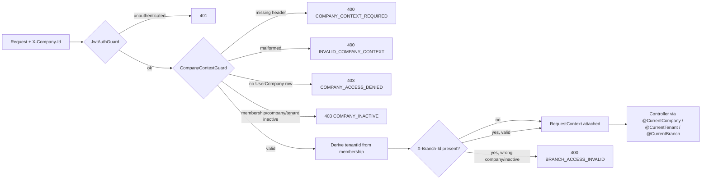

# Multi-company architecture

This document covers how the platform decides "which company is this
request operating as," how that's enforced on the backend, and how the
two frontend apps (Gestión, Facturación) select and remember a company.
Read this before adding any company-scoped backend endpoint or frontend
query.

See also [product-ui-principles.md](product-ui-principles.md) for the
Gestión/Facturación product split this builds on, and the root
[CLAUDE.md](../CLAUDE.md) for the permanent rules extracted from this doc.

## The three separate questions

- **Authentication** — "who is the user?" Handled entirely by `apps/api/src/auth`.
- **Company context** (this document) — "which company are they operating
  right now?"
- **Authorization/RBAC** (a later task) — "what is that user allowed to do
  there?"

These stay separate mechanisms on purpose. Company context never grants
permissions, and authentication never implies a company.

## Data model

Already established in the foundation schema (`apps/api/prisma/schema.prisma`) — this task added no new models, only the service/API layer on top:

```
User ──< UserCompany >── Company ──> Tenant
                                       ^
                             Branch ───┘ (also belongs to a Company)
```

- `UserCompany` is the **sole source of truth** for which companies a user
  may access. `active: false` revokes access without deleting history.
- `Tenant`/`Company`/`Branch` each carry their own `status`. Any one of
  membership-inactive, company-inactive, or tenant-inactive blocks access.
- Tenant is derived from the validated `UserCompany` row, never supplied
  by the client. There is no `X-Tenant-Id` header.

## Request-scoped context, not a stored "active company"

`session.activeCompanyId` is deliberately **not** a thing. A user can have
Gestión open on Company A and Facturación open on Company B in the same
browser at once — company context has to be resolved per-request, not
pinned to the session.



### Backend pieces (`apps/api/src/company-context`)

- `types.ts` — `RequestContext { userId, companyId, tenantId, branchId?, sessionId? }`.
  IDs only, deliberately — services shouldn't depend on Prisma entity shapes.
- `company-context.service.ts` — the only place that decides "may this
  user act as this company." `validateCompanyAccess` / `validateBranchAccess`.
- `guards/company-context.guard.ts` — reads `X-Company-Id`/`X-Branch-Id`,
  validates format, calls the service, attaches `request.companyContext`.
- `decorators/company-scoped.decorator.ts` — `@CompanyScoped()` = `@Authenticated()` + the guard above, in that order (the guard needs `request.user` already set).
- `decorators/current-*.decorator.ts` — `@CurrentCompany()`, `@CurrentTenant()`, `@CurrentBranch()`, `@CurrentRequestContext()`. Use these in controllers instead of re-parsing headers.
- `company-context.controller.ts` — the endpoints below.

### Endpoints

| Endpoint                                     | Guard              | Notes                                                                                         |
| -------------------------------------------- | ------------------ | --------------------------------------------------------------------------------------------- |
| `GET /context/companies`                     | `@Authenticated()` | Only companies the user has active access to.                                                 |
| `GET /context/companies/:companyId`          | `@Authenticated()` | 403/`COMPANY_ACCESS_DENIED` if inaccessible — never a plain 404 that would confirm existence. |
| `GET /context/companies/:companyId/branches` | `@Authenticated()` | Active branches; company access checked first.                                                |
| `GET /context/current`                       | `@CompanyScoped()` | Verification endpoint for the guard chain itself — not a business feature.                    |

### Error codes

`COMPANY_CONTEXT_REQUIRED` (400), `INVALID_COMPANY_CONTEXT` (400),
`COMPANY_ACCESS_DENIED` (403), `COMPANY_INACTIVE` (403),
`BRANCH_ACCESS_INVALID` (400). `AllExceptionsFilter` reads an explicit
`code` off the exception body when present (see
`CompanyContextException`), so several codes can share one HTTP status.

**No-membership and inactive-membership deliberately return different
codes.** `COMPANY_ACCESS_DENIED` covers "no `UserCompany` row at all" —
which is also what you get for a company belonging to another tenant, or
one that doesn't exist at all. Same response in every case, so a response
never confirms whether an inaccessible company exists. `COMPANY_INACTIVE`
is only reachable once a membership row is confirmed to exist, so it's
safe to be specific there.

### Rule for every future company-owned entity

See CLAUDE.md — copied here because it matters this much:

> Never load a company-owned entity by its ID alone in an authenticated
> business operation. Always scope the lookup by the validated `companyId`
> from `RequestContext`. `findUnique({ id })` is not sufficient
> authorization; use `findFirst({ id, companyId: ctx.companyId })` or the
> equivalent for the model's constraints.

We deliberately did **not** build a global Prisma middleware that
silently injects `companyId` into every query. That kind of implicit
behavior is easy to get subtly wrong and hard to audit. Explicit scoping
at each call site, using the helpers in `company-context`, is preferred.

## Tenant exposure — decision

`tenantId` is **not** returned in `/context/companies`, `/context/companies/:id`, or `/auth/me`. The frontend operates entirely around Company identity; tenant is an internal/architectural concept the backend derives and enforces, and there's no legitimate frontend use for it yet. If a future module genuinely needs to display tenant information, add it deliberately then — don't reintroduce it defensively.

`/auth/me` also no longer returns a `companies` summary (it did briefly during the auth-only foundation). `GET /context/companies` is now the single source for "which companies can this user access" — one endpoint, one query, instead of the same membership logic living in two services.

## Frontend

### Shared client (`packages/auth-client`)

- `company-context-store.ts` — a plain (non-React) store over
  `localStorage`, namespaced per app (`storageKeyPrefix: 'gestion'` /
  `'facturacion'`) so the two apps can hold different active
  companies/branches at the same time. The selected company id is **not**
  a secret — it's convenience persistence, never used for authorization.
- `api-client.ts` — `apiFetch` reads the store on every request and
  attaches `X-Company-Id`/`X-Branch-Id` automatically when set. If a
  company-scoped request comes back `COMPANY_ACCESS_DENIED` or
  `COMPANY_INACTIVE` (e.g. an admin revoked access mid-session), the
  client clears the stale selection immediately — it never retries the
  same request in a loop.
- `company-context-hooks.ts` — `useCompanies`, `useActiveCompany`,
  `useBranches`, `useActiveBranch`. `useActiveCompany`/`useActiveBranch`
  implement the restore flow below; both apps call the same hooks.

### Restore flow (same logic, both apps)

```
authenticated?
  → load /context/companies
  → remembered company still in that list?
      yes → keep it
      no  → clear it
  → resolved company?
      none, and exactly one accessible company → auto-select it
      none, and 2+ accessible                  → caller shows a picker
      none, and 0 accessible                   → caller shows "no companies"
```

Never trust a stale `localStorage` value without re-validating it against
a freshly-loaded company list — this is why `useActiveCompany` always
re-derives from the query result, not from the store alone.

### Gestión

Top bar shows the active company: a plain label with one company, a
compact native `<select>` with several — no dropdown chrome when there's
nothing to decide (CLAUDE.md's "ask only when there's a decision to
make"). Zero companies → a dedicated empty state, never a redirect loop.
2+ companies with none selected → a one-click picker in place of the
(currently empty, foundation-only) dashboard.

### Facturación

Same company resolution, plus a branch selector next to it — branches are
load-bearing here (future POS, cash registers, invoice numbering). One
active branch auto-selects; several show a compact selector. Switching
company always clears the branch (branches belong to a company — a
leftover branch id from a previous company must never survive a switch),
then branches for the new company are (re)resolved through the same
auto-select/prompt logic.

### Query cache isolation

Company-scoped query keys must include the active company:

```
Bad:  ["customers"]
Good: ["company", companyId, "customers"]
```

`setActiveCompany` removes every cached query under the `"company"` root
key on switch — so even before any business module reads/writes
company-scoped data, the invalidation contract is already in place and
tested by construction. No business module exists yet to exercise this
beyond the pattern itself, but every future one must follow it.
