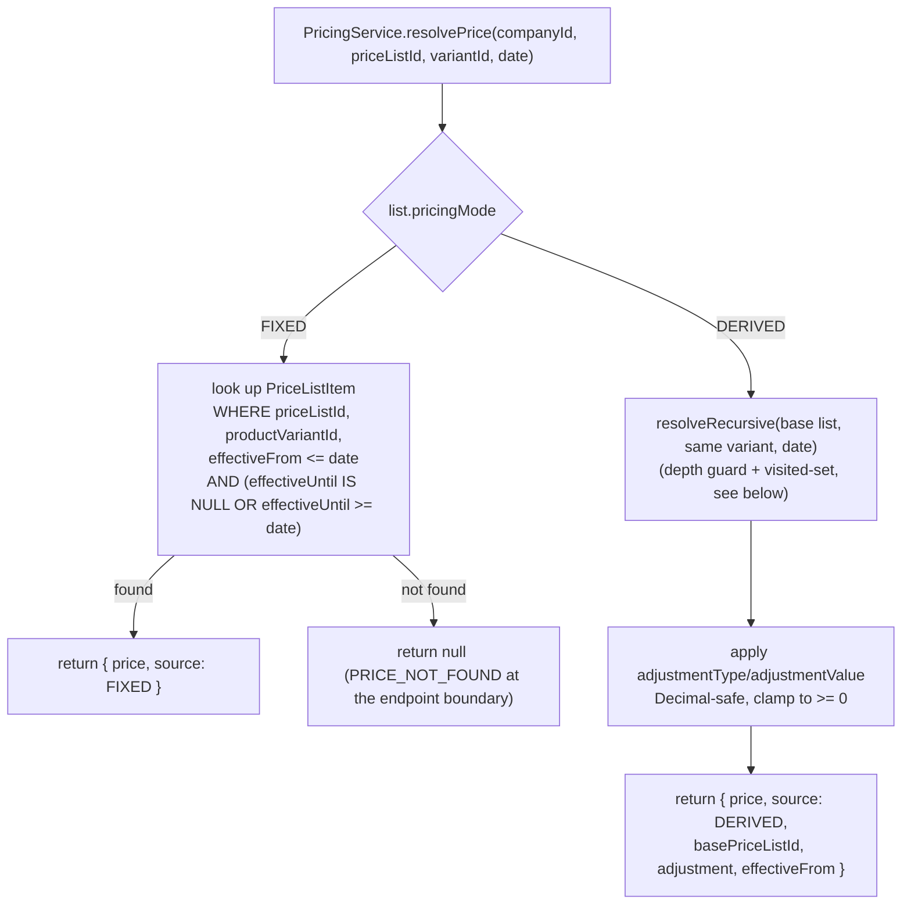
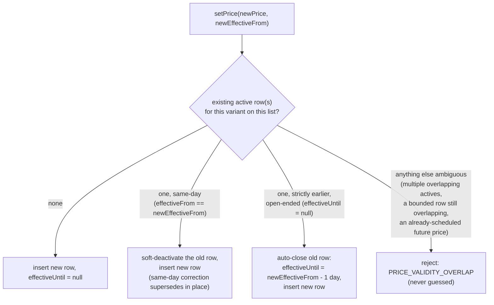
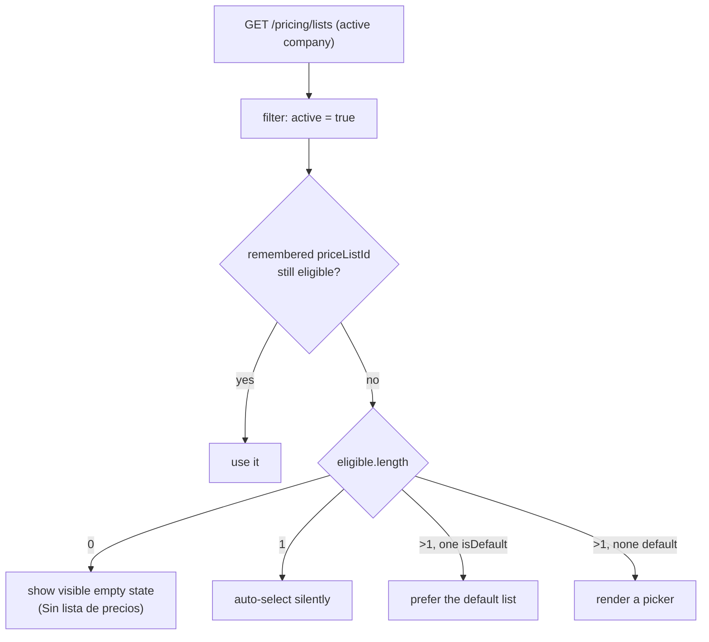

# Pricing (price lists, resolution, and price history)

This document covers the pricing foundation: `Currency`, `PriceList`,
`PriceListItem`, `PriceHistory`, and `PricingService`. Read this before
touching `apps/api/src/pricing` or Gestión's `/listas-de-precios`.

See also [products.md](products.md) (Product/ProductVariant own catalog
identity; Pricing owns sale price), [inventory.md](inventory.md) (stock is
a completely independent concern from price — a product can have a price
at `ON_HAND = 0`), [authorization.md](authorization.md) (the `pricing.*`
permissions), [audit-architecture.md](audit-architecture.md), and the root
[CLAUDE.md](../CLAUDE.md) for the permanent rules extracted from this doc.

## What this module is — and isn't

Pricing answers **what a product sells for, on which list, right now (or
on any date in the past)**. It does not answer what the item is
(`Product`/`ProductVariant`, see products.md), how much of it exists
(Inventory, see inventory.md), what it costs to buy or produce (a future
Purchases/costing module), or what VAT/tax applies to it (a future Tax
engine — `includesTax` is stored metadata only, never computed here).

The central design decision, stated once so every other section can rely
on it:

> **A `Product`/`ProductVariant` never owns an authoritative sale price.
> `PriceListItem` is the only place a sale price is stored, and only
> through `PricingService`.**

The same product can be sold at several different prices simultaneously
(Minorista, Mayorista, Distribuidor, E-commerce, ...) — a single
`product.price` column could never represent that, so none exists, now or
later.

## Currency

`Currency` is **global** (no `tenantId`/`companyId`) — a deliberate
deviation from the company-scoped precedent set by `UnitOfMeasure`
(products.md): a currency (ARS/USD/EUR) is universal ISO-style reference
data, identical across every company, unlike a unit of measure, which is a
genuine per-company configuration choice. `code`/`name`/`symbol`/
`decimalPlaces`/`active`; only active currencies may be assigned to a new
`PriceList`.

**Historical currency rule**: prices stored in a list's currency are
**never** auto-converted when exchange rates change. There is no
`ExchangeRate` model in this task. A future Sales module will snapshot
`currencyId`/`exchangeRate`/`unitPrice` on the sales document itself at
the moment of the transaction — not implemented here, and not something
`PricingService` needs to anticipate beyond leaving room for it.

## PriceList

```
code, name          unique per company (companyId+code, companyId+name)
description         optional
currencyId           FK Currency — locked after creation (see below)
includesTax          metadata only — no VAT calculation exists
pricingMode          FIXED | DERIVED — locked after creation
basePriceListId      DERIVED only — FK to another PriceList
adjustmentType       DERIVED only — PERCENTAGE_INCREASE | PERCENTAGE_DECREASE |
                     FIXED_AMOUNT_INCREASE | FIXED_AMOUNT_DECREASE
adjustmentValue      DERIVED only — NUMERIC(9,6), always unsigned;
                     direction comes from adjustmentType, never a sign
isDefault            at most one true per company — see "Default list"
active               deactivate/reactivate, never physically deleted
```

`pricingMode` and `currencyId` are **not editable after creation** —
switching either would silently reinterpret every existing
`PriceListItem` row under different semantics. Create a new list instead.
`basePriceListId`/`adjustmentType`/`adjustmentValue` **are** editable
post-creation (a "derived rule changed" is a normal, auditable scenario —
see "Audit"), but only when the list is already `DERIVED`, validated
server-side against the existing record.

### FIXED vs DERIVED



- **FIXED** lists hold explicit `PriceListItem` rows with validity ranges.
  All mutation goes through `PricingService.setPrice`/`setPrices` — never
  a direct `prisma.priceListItem.create/update` anywhere else in the
  codebase.
- **DERIVED** lists compute a price at **read time** from
  `basePriceListId` + `adjustmentType`/`adjustmentValue`, recursively
  through however many DERIVED links exist. A DERIVED list's resolved
  price is **never materialized** into a `PriceListItem` row — there is no
  code path anywhere that writes a `PriceListItem` for a list whose
  `pricingMode` is `DERIVED`.

### Cycle prevention

Cycles (`A → A`, or `A → B → C → A`) are rejected at **write time** —
`PriceListsService.assertNoCycle` walks the proposed `basePriceListId`
chain (both on create and on update, whenever `basePriceListId` changes)
and throws `PRICE_LIST_CYCLE` before anything is persisted. A **separate**
defensive guard exists at **read time** inside
`PricingService.resolveRecursive`: a `visited: Set<string>` plus a hard
`MAX_DERIVATION_DEPTH = 10` — this protects against an invariant
violation (e.g. a bad manual DB fix), it is not the primary mechanism, and
should never actually trigger in normal operation.

### Currency mismatch

A DERIVED list must share its base list's currency — cross-currency
auto-derivation is out of scope for this task. Creating or updating a
DERIVED list with a base of a different currency is rejected with
`PRICE_LIST_CURRENCY_MISMATCH`.

## PriceListItem

```
priceListId, productVariantId
price               NUMERIC(19,4) — zero allowed (bonificaciones,
                    muestras, items sin cargo), negative always rejected
effectiveFrom       DATE (not DATETIME) — business-day granularity
effectiveUntil      DATE, nullable — null means "valid until replaced"
active
```

**Effective dates are DATE, not TIMESTAMP.** A price change takes effect
from the start of a calendar day, never a specific minute — this is a
deliberate, documented choice, not an oversight; nothing in this module
mixes DATE and DATETIME semantics for price validity.

### Overlap prevention and the auto-close rule

Two active `PriceListItem` rows for the same
`(companyId, priceListId, productVariantId)` must never have ambiguously
overlapping validity — `PRICE_VALIDITY_OVERLAP` is thrown otherwise.
Rather than forcing a caller to manually close the previous period every
time, `PricingService.applyPriceChange` implements an ERP-friendly rule:



This is the one place the module makes a judgment call instead of
rejecting outright — and only in the single unambiguous case (one prior
open-ended row, strictly in the past). Every other shape of overlap is
rejected rather than guessed.

**Historical prices are never destructively overwritten.** Editing "the
current price" in Gestión always creates a *new* `PriceListItem` row (and
a new `PriceHistory` row) and closes the previous validity range per the
rule above — it never mutates a past row's `price` in place.

## PriceHistory

```
priceListId, productVariantId
oldPrice        nullable — null on the very first price ever set
newPrice
effectiveFrom
changeType      INITIAL | MANUAL | BULK_ADJUSTMENT
reason          optional free text
changedBy       nullable user id
changedAt       server timestamp of when the change was recorded
```

**`PriceHistory` is explicitly distinct from `AuditLog`.** `PriceHistory`
answers *"how did the commercial price evolve"* (Café 1 kg went from
$15.500 to $18.500 on 2026-08-01) — it is domain/business data, queried
per variant-per-list via `PricingService.getPriceHistory`, and rendered
inline in a price table row (see "Gestión"). `AuditLog` answers *"who
performed the administrative action"* (Admin User updated the Minorista
price list) and lives in the general Auditoría trail (see
audit-architecture.md). A single price update through `setPrice`/
`setPrices` generates **both**: one `PriceHistory` row (via
`applyPriceChange`) and one `AuditLog` `UPDATE` event on the `PriceList`
entity (`metadata.change: 'price_set'` or `'prices_batch_set'`) — neither
ever replaces the other.

## PricingService

The single, centralized entry point for every price read and write —
nothing else in the codebase queries or mutates `PriceListItem`/
`PriceHistory` directly.

```
getPrice(companyId, priceListId, variantId, date?)   → resolved price or null
getPrices(companyId, priceListId, variantIds[], date?) → batch resolution
setPrice(ctx, priceListId, variantId, input)         → FIXED lists only
setPrices(ctx, priceListId, input)                   → batch set, one transaction,
                                                        whole-batch rollback on
                                                        any invalid line
previewBulkAdjust(companyId, priceListId, input)     → no DB writes
confirmBulkAdjust(ctx, priceListId, input)           → transactional, FIXED only
getPriceHistory(companyId, priceListId, variantId, query)
```

**Missing price is never silently zero.** `getPrice` returns `null` when
no price can be resolved (no `PriceListItem`, or a DERIVED chain that
bottoms out with nothing); the HTTP boundary either surfaces
`PRICE_NOT_FOUND` or a `found: false` field depending on the endpoint's
semantics (single lookup vs. batch lookup) — this distinction is
deliberate and documented at each call site, and is the property a future
Facturación/POS checkout will depend on to never charge $0 for an
unpriced item.

**Bulk-adjust only touches existing prices.** `computeBulkAdjustLines`
skips any candidate variant with no currently-resolvable price rather
than creating one — bulk-adjust is a percentage/fixed adjustment of
*existing* prices, distinct in scope from `setPrices` (batch set), which
*can* establish new prices for previously-unpriced variants.

### Rounding and Decimal safety

Every arithmetic step — DERIVED resolution, bulk adjustment, and anywhere
else a price is computed rather than typed by a user — uses
`Prisma.Decimal` (decimal.js), never a JS `number`/float and never
`Math.round(price * 100) / 100`. Rounding is centralized and respects the
currency's `decimalPlaces` via `.toDecimalPlaces(n, Prisma.Decimal.ROUND_HALF_UP)`.
A negative result from a `FIXED_AMOUNT_DECREASE` adjustment is clamped to
zero (`Prisma.Decimal.max(value, 0)`), never left negative and never
rejected outright — zero is a legitimate price. Optional "commercial
rounding" (round to `.99`, nearest 10, etc.) is explicitly **not**
implemented in this task.

## Default list

At most one `PriceList` may have `isDefault: true` per company. Switching
the default is **atomic** — the same transaction that sets the new
default's `isDefault: true` also clears it on every other list for that
company (`updateMany({ where: { companyId, isDefault: true, id: { not:
id } }, data: { isDefault: false } })`), the same pattern already
established for `CustomerAddress.isDefault` (customers.md).

A company may have **zero** price lists (a brand-new company before
anyone configures pricing). Gestión shows an empty state, never an error.
A future Facturación will show a clear "no price list configured"
operational error rather than crashing or fabricating a price — not
implemented as a real error surface in this task since no sales flow
exists yet to trigger it.

## Company isolation

Same rule as every other module (see root CLAUDE.md): a `PriceList` from
Company A must never appear, be selectable as a base, receive
`PriceListItem` rows, or resolve a price for Company B. Every service
method takes `companyId` (or a full `RequestContext`) and every Prisma
query scopes by it — `findFirst({ where: { id, companyId } })`, never
`findUnique({ where: { id } })` alone. A `basePriceListId` supplied on
create/update is independently re-validated to belong to the same company
before it's accepted (`assertValidBase`) — a cross-company base is
rejected the same as a nonexistent one, never distinguished in the error
response.

## Permissions

```
pricing.lists.read
pricing.lists.create
pricing.lists.update
pricing.lists.deactivate
pricing.prices.read
pricing.prices.update
pricing.prices.bulk_update
```

`pricing.lists.*` governs the list itself (its configuration); `pricing.
prices.*` governs the prices inside it. This separation is deliberate — a
salesperson may need `prices.read` (see current prices) without
`prices.update` (change them), the same "read is not update" philosophy
as `inventory.stock.read` vs `inventory.adjustments.*` (inventory.md).
`bulk_update` is its own gate, separate from `update`, since a bulk
adjustment can move many prices at once — a bigger blast radius than
editing one row.

Default role grants: ADMIN gets everything. MANAGER (Gerente) gets
`lists.read/create/update` + `prices.read/update/bulk_update` (and
`lists.deactivate`). SALES (Ventas) and PURCHASES (Compras) get
`lists.read` + `prices.read` only. WAREHOUSE (Depósito) and TREASURY
(Tesorería) get none — pricing isn't part of either role's job. VIEWER
(Solo lectura) gets `lists.read` + `prices.read`, matching its
read-everything philosophy.

## Audit

`PriceList` create/update/deactivate/reactivate are audited under
`entityType: 'PriceList'` with meaningful before/after values — an update
diffs only the fields that actually changed
(`code`/`name`/`description`/`includesTax`/`basePriceListId`/
`adjustmentType`/`adjustmentValue`/`isDefault`), so "default list changed"
and "derived rule changed" both show up as ordinary, readable update
events rather than a special case.

A single-price edit (`setPrice`) and a batch edit (`setPrices`) each add
one `UPDATE` audit event on the `PriceList` entity
(`metadata.change: 'price_set'` / `'prices_batch_set'`) — see
"PriceHistory" above for why this is *in addition to*, not instead of, a
`PriceHistory` row.

**Bulk adjustment audit is a single meaningful event, never per-row
noise** — directly applying the same principle CLAUDE.md already states
for `RolesService`'s `PERMISSIONS_CHANGE` pattern. `confirmBulkAdjust`
writes **one** `PriceList` `UPDATE` audit record containing the full
scope (`ALL`/`CATEGORY`/`BRAND` + the resolved `categoryId`/`brandId`),
the adjustment (`adjustmentType`/`value`), `effectiveFrom`,
`affectedCount`, and `reason` — never one `AuditLog` row per affected
variant. `PriceHistory` still gets one row per affected variant
(`changeType: 'BULK_ADJUSTMENT'`) — the commercial record and the
administrative audit record are always kept separate, per the module's
central `PriceHistory` vs `AuditLog` distinction above.

`PriceListItem` itself has no direct audit entries — its changes are
always audited through its parent `PriceList` (`AUDIT_ENTITY_LABELS`
documents this explicitly), the same "sub-resource audits under its
parent" pattern already used for `CustomerAddress`/`ProductVariant`.

## API

All routes are company-scoped (see CLAUDE.md — never trust
`companyId`/`tenantId` from the request body).

| Method | Path | Permission |
| --- | --- | --- |
| GET | `/pricing/lists` | `pricing.lists.read` |
| GET | `/pricing/lists/:id` | `pricing.lists.read` |
| POST | `/pricing/lists` | `pricing.lists.create` |
| PATCH | `/pricing/lists/:id` | `pricing.lists.update` |
| POST | `/pricing/lists/:id/deactivate` | `pricing.lists.deactivate` |
| POST | `/pricing/lists/:id/reactivate` | `pricing.lists.deactivate` |
| GET | `/pricing/lists/:id/history` | `pricing.lists.read` (administrative history) |
| GET | `/pricing/lists/:id/items` | `pricing.lists.read` |
| PUT | `/pricing/lists/:priceListId/products/:variantId` | `pricing.prices.update` |
| PUT | `/pricing/lists/:priceListId/prices` | `pricing.prices.update` (batch) |
| POST | `/pricing/lists/:id/bulk-adjust/preview` | `pricing.prices.bulk_update` |
| POST | `/pricing/lists/:id/bulk-adjust` | `pricing.prices.bulk_update` |
| GET | `/pricing/lists/:listId/products/:variantId/history` | `pricing.prices.read` (commercial history) |
| GET | `/pricing/currencies` | `pricing.lists.read` |
| GET | `/pricing/lookup` | `pricing.prices.read` |
| POST | `/pricing/lookup/batch` | `pricing.prices.read` |
| GET | `/pricing/products/:productId/prices` | `pricing.prices.read` |

`GET /pricing/lists/:id/items` joins catalog data (Product/ProductVariant)
with resolved pricing at **read time** — it never stores a duplicate
product name inside `PriceListItem`. Its `hasPrice` filter is computed
(fetch the candidate set, resolve each price, filter, then paginate in
memory), the same documented trade-off as `InventoryService.listStock`'s
`belowMinimum` filter (inventory.md); the common (no `hasPrice`) path
still uses plain DB-level `skip`/`take`.

## Gestión

A **Listas de precios** entry sits in the sidebar between Productos and
Stock (only shown to `pricing.lists.read`):

- **`/listas-de-precios`** — Código/Nombre/Moneda/Tipo/Incluye impuestos/
  Predeterminada/Estado, "Nueva lista" primary action.
- **`/listas-de-precios/nueva`** — progressive disclosure: choosing
  Tipo = Derivada reveals Lista base/Tipo de ajuste/Valor; a FIXED list
  never shows those fields at all.
- **`/listas-de-precios/:id`** — Resumen / Precios / Historial y
  auditoría tabs, never one giant edit-everything form. Resumen shows a
  plain-language derivation banner for DERIVED lists ("Esta lista se
  calcula desde Minorista. Ajuste: Descuento porcentual 10%.").
  - **Precios** (FIXED): a filterable, paginated price table
    (Código/Producto/SKU/Categoría/Precio actual/Vigente desde) with
    table-based inline editing — typing in a price cell only updates
    local pending state, never fires a mutation per keystroke; a sticky
    "N cambios sin guardar" / "Guardar cambios" bar commits every pending
    edit in one `setPrices` batch call. Each row has a "Ver historial"
    toggle that expands an inline `PriceHistory` panel for that variant
    (old → new, vigente desde, tipo de cambio, actor, motivo) — no
    separate page/modal needed.
  - **Precios** (DERIVED): the same table, **read-only** — no price cell
    is ever editable, since a DERIVED list has no `PriceListItem` rows of
    its own to edit.
  - **Historial y auditoría**: the list's own `AuditLog` trail (created/
    updated/deactivated/default changed/derived rule changed/bulk
    adjustment applied), rendered as one readable sentence per event —
    this is deliberately the *administrative* trail, not a duplicate of
    per-variant `PriceHistory`.
- **`/listas-de-precios/:id/actualizacion-masiva`** (FIXED only, gated on
  `pricing.prices.bulk_update`) — scope (todos/categoría/marca) → tipo de
  ajuste + valor → vigente desde → **Vista previa** (no database writes)
  → **Confirmar actualización**. Changing any input after a preview was
  generated visibly marks it stale and disables Confirmar until a fresh
  preview is generated — a confirm can never fire against parameters the
  user hasn't actually seen priced out.

`Producto` detail gets a real **Precios** tab (only rendered when the
viewer has `pricing.prices.read`) showing every active price list's
current price for the product — `price: null` always renders "Sin
precio", never a fabricated "$0". No stock, cost, or margin is shown
here; that's `inventory.md`'s Stock tab, a completely separate concern.
The product's own **Historial** tab does **not** duplicate every pricing
event — price history lives in the price list's own Historial tab (and
per-variant, inline on its Precios table) instead.

Every pricing-related TanStack Query key is scoped by `companyId` (e.g.
`['company', companyId, 'pricing', 'lists', 'list']`), and the future
Facturación operational-pricing keys additionally include `priceListId`
(e.g. `['company', companyId, 'pricing', 'lookup', priceListId, query]`)
— see CLAUDE.md's cache-isolation rule.

## Facturación / POS

Facturación's `/ventas/nueva` and POS (`/pos`) both drive real cart
pricing through this foundation — see [facturacion.md](facturacion.md)
and [pos.md](pos.md): `POST /pricing/lookup/batch` resolves every visible
search result and cart line in one batched call (never a request per
row), and confirming a sale snapshots each line's price via
`SalesService`/`PricingService.getPrice` (see [sales.md](sales.md)) —
never a second, frontend-side pricing calculation.

A `PriceListSelector` sits in the topbar next to the warehouse selector,
backed by `useActivePriceList()` in `@erp/auth-client` — the same shape
as `useActiveWarehouse()` (inventory.md), company-scoped rather than
branch-scoped since a price list is never tied to a branch:



The remembered `priceListId` is **UX-only, never authorization** — the
backend independently re-validates company+active on every real pricing
operation (`PricingService.loadPriceList`), the same as every other
company-scoped lookup. Selecting a new company always clears the
remembered price list (`setActiveCompanyId` in
`company-context-store.ts`), so a stale selection from a previous company
can never silently carry over — switching companies away and back
re-resolves from scratch (falling back to the default list) rather than
restoring a memory that may not even apply to the new company.

## Deferred

Out of scope for this task, intentionally: sales orders, sales quotes,
delivery notes, sales invoices, credit/debit notes, POS cart, payments,
invoice-level manual price override, discount authorization, promotions,
coupons, quantity-based (tiered) pricing, customer-specific pricing
(`Customer.priceListId` does **not** exist — a future `Customer` may gain
an optional default `PriceList`, with the eventual resolution priority
*explicit document list → customer default → company default*, not
implemented now), tax/VAT calculation, ARCA integration, inventory
costing, profitability/margin display, purchase costs, currency
conversion at sale time, price import/export, and e-commerce price
synchronization.
