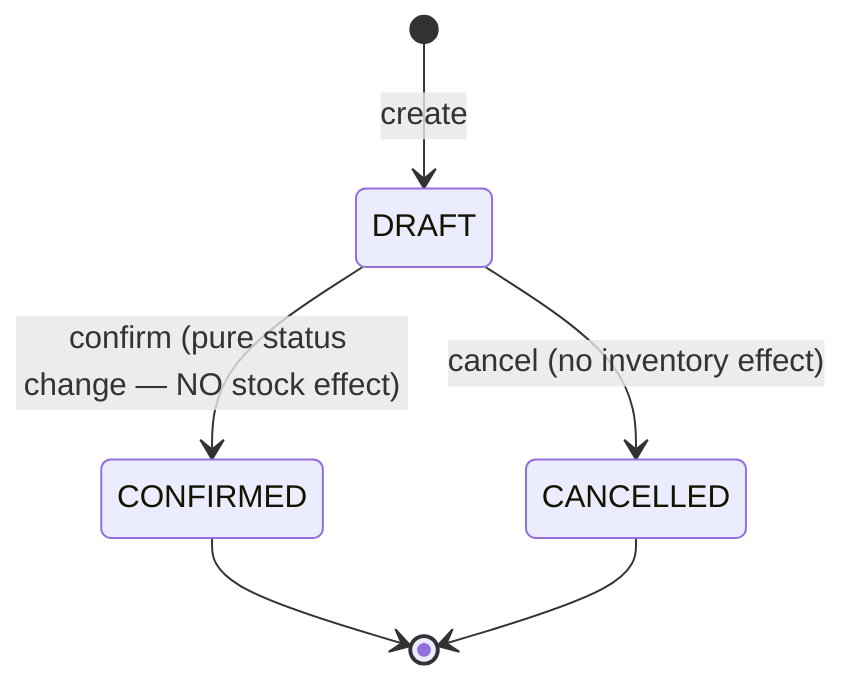
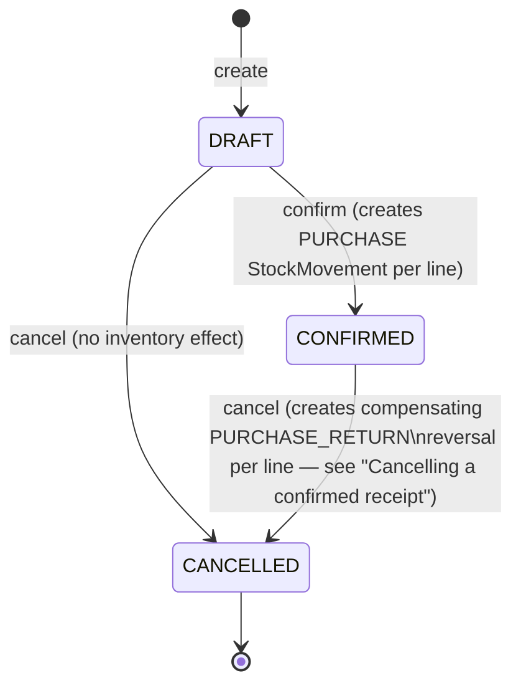
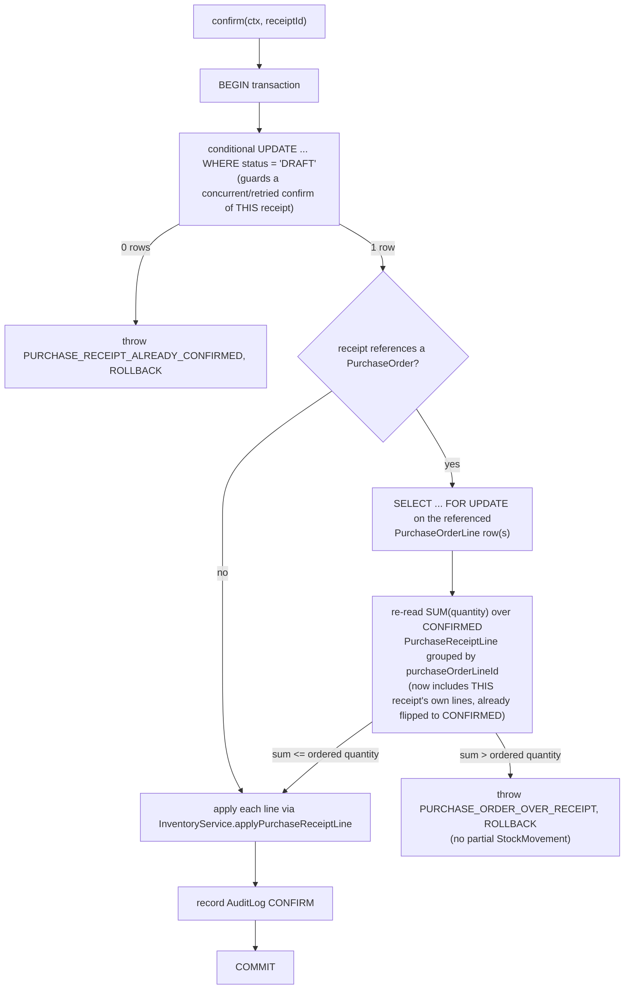

# Purchases (Suppliers, Purchase Orders, Goods Receipts)

This document covers the Purchases domain: `Supplier`, `PurchaseOrder`/
`PurchaseOrderLine`, `PurchaseReceipt`/`PurchaseReceiptLine`, and the three
services that own them (`SuppliersService`, `PurchaseOrdersService`,
`PurchaseReceiptsService`, all under `apps/api/src/purchases`). Read this
before touching that module or Gestión's `/compras`.

See also [inventory.md](inventory.md) (`InventoryService` is the only
writer of `StockMovement`, including the `PURCHASE`/`PURCHASE_RETURN`
movements this module produces), [sales.md](sales.md) (the closest
existing analog — same confirm/cancel shape, same "one document family,
not a parallel implementation" philosophy), [customers.md](customers.md)
(`Supplier` mirrors `Customer`'s shape and Argentina tax-id handling),
[pricing.md](pricing.md) (the `Currency` catalog both domains share),
[authorization.md](authorization.md) (the `purchases.*` permissions),
[audit-architecture.md](audit-architecture.md), and the root
[CLAUDE.md](../CLAUDE.md) for the permanent rules extracted from this doc.

## What this module is — and isn't

Two separate documents on purpose, mirroring the reasoning in sales.md:

> **`PurchaseOrder` is commercial intent. `PurchaseReceipt` is a physical
> inventory event.** Confirming a Purchase Order changes nothing about
> stock — it's a record that the company has committed to buy specific
> quantities from a specific supplier at a specific cost. Only a
> `PurchaseReceipt` — the record of goods physically arriving — ever
> creates a `StockMovement`. A `PurchaseOrder` can have zero, one, or many
> `PurchaseReceipt`s (partial receiving is the normal case, not an edge
> case), and a `PurchaseReceipt` can exist with no `PurchaseOrder` at all
> (a direct/spot receipt).

This is **not** a fiscal purchase invoice, not accounts payable, and not a
supplier current-account ledger — see "Deferred" below.

## Supplier

```
tenantId, companyId
code               company-scoped sequence (auto) or manual override
legalName          required
tradeName          optional
documentType       CustomerDocumentType (CUIT/CUIL/DNI/...) — reused, see
                    "Naming deviations" below
taxId              optional, normalized digits-only
taxCondition       CustomerTaxCondition — reused, see "Naming deviations"
email, phone, address, city, province, postalCode, notes   optional
status             ACTIVE | INACTIVE — never physically deleted
createdBy, updatedBy
```

Same "don't reveal existence outside the caller's scope" and
active-only-taxId-uniqueness rules as `Customer` (see customers.md):
`taxId` is not a DB-level unique constraint, uniqueness among **ACTIVE**
suppliers within a company is enforced in `SuppliersService`, and a
deactivated supplier's tax id can be reused. Deliberately a smaller
surface than `Customer` — no addresses/contacts/categories collections —
see "Extension points" below.

## PurchaseOrder / PurchaseOrderLine

```
PurchaseOrder:
  tenantId, companyId, branchId (nullable)
  number                company-scoped sequence — "OC-000001"
  supplierId            FK Supplier — must be ACTIVE at creation/update time
  orderDate             defaults to now()
  expectedDeliveryDate  optional
  currencyId            FK Currency — must be `active`; ARS/USD (at least)
                        are supported, no FX conversion exists (see Deferred)
  status                DRAFT | CONFIRMED | CANCELLED
  total                 sum of line lineTotal — ALWAYS server-computed,
                        never accepted from the client
  notes                 optional
  confirmedAt/By, cancelledAt/By   nullable, set on transition
  createdBy

PurchaseOrderLine (no tenantId/companyId of its own — scoped via purchaseOrder):
  productVariantId
  quantity      NUMERIC(19,6), always > 0, precision-checked against the
                product's base UnitOfMeasure.decimalPlaces
  unitCost      NUMERIC(19,6) — the supplier's quoted cost, ACCEPTED from
                the client (unlike a Sales line's price, there is no
                pricing engine for purchase costs to resolve it from)
  lineTotal     quantity * unitCost — server-computed
```

`companyId`/`tenantId`/`total`/every line's `lineTotal` are never trusted
from the request body — same rule as every other module.

## PurchaseReceipt / PurchaseReceiptLine

```
PurchaseReceipt:
  tenantId, companyId, branchId (nullable)
  number            company-scoped sequence — "RC-000001"
  supplierId        FK Supplier — must be ACTIVE
  warehouseId       FK Warehouse — must be ACTIVE and allowsPurchases=true
  purchaseOrderId   OPTIONAL FK PurchaseOrder — see "Direct vs PO-linked
                    receipts" below
  receiptDate       defaults to now()
  currencyId        derived from the PO when purchaseOrderId is set
                    (never trusted from the client in that case — same
                    "never contradict the source" rule as SalesDocument's
                    currencyId); REQUIRED from the client for a direct
                    receipt (PURCHASE_RECEIPT_CURRENCY_REQUIRED otherwise)
  status            DRAFT | CONFIRMED | CANCELLED — see "State machine"
  notes             optional
  confirmedAt/By, cancelledAt/By   nullable, set on transition
  createdBy

PurchaseReceiptLine (no tenantId/companyId of its own — scoped via purchaseReceipt):
  productVariantId
  purchaseOrderLineId    REQUIRED when the receipt has a purchaseOrderId,
                         FORBIDDEN otherwise (validated in the Zod schema
                         for create, and again in the service for update
                         since a receipt's purchaseOrderId is immutable
                         and updatePurchaseReceiptSchema doesn't carry a
                         purchaseOrderId of its own to re-derive it from)
  quantity               NUMERIC(19,6), always > 0, precision-checked
  unitCostSnapshot       NUMERIC(19,6) — a commercial cost snapshot, never
                         mutates Product.cost, never feeds a costing/
                         valuation calculation in this task (see Deferred)
```

### Direct vs PO-linked receipts

`purchaseOrderId` is optional. When present:

- the referenced order must belong to the same company and be
  **CONFIRMED** (`PURCHASE_RECEIPT_ORDER_NOT_CONFIRMED` otherwise — a
  DRAFT order is not yet a commitment, and a CANCELLED one never will be);
- its `supplierId` must equal the receipt's own `supplierId`
  (`PURCHASE_RECEIPT_SUPPLIER_MISMATCH` otherwise);
- every line's `purchaseOrderLineId` must be one of that order's own
  lines, and that line's `productVariantId` must match
  (`PURCHASE_RECEIPT_LINE_NOT_FROM_ORDER` otherwise) — matched by the
  explicit `purchaseOrderLineId` edge, **never** a best-effort match by
  `productVariantId` alone, so two lines of the same variant on one order
  are never ambiguous.

When absent, the receipt is a **direct/spot receipt** — goods arriving
with no prior order in the system. `currencyId` is required in this case.

## State machines



**PurchaseOrder** — `CONFIRMED` and `CANCELLED` are both terminal, same as
`SalesDocument`. There is no `CONFIRMED -> CANCELLED` transition: a
mistaken confirmed order cannot be un-confirmed through this API.



**PurchaseReceipt** — deliberately **different** from every other
confirmed-document rule in this codebase (`SalesDocument`,
`StockAdjustment`, `PurchaseOrder` all treat `CONFIRMED` as terminal). A
`CONFIRMED` receipt **can** still move to `CANCELLED`, because a physical
receipt correction (goods were actually returned to the supplier, or the
receipt was logged in error after the fact) is exactly the situation the
"new reversing entry, never edit history" ledger philosophy exists for —
see `docs/inventory.md` and CLAUDE.md's "Confirmed financial/inventory
transactions are not physically deleted" invariant.

Both `DRAFT -> CONFIRMED` and either cancel path use the same
conditional-update-first idempotency guard as `SalesService.confirm` (see
sales.md's "Idempotent confirmation") — a retried or genuinely concurrent
double-confirm/double-cancel is safe.

## Partial receiving

A `PurchaseOrderLine`'s "received so far" is **always derived at read
time**, never a stored mutable counter:

```
receivedQuantity(line) = SUM(PurchaseReceiptLine.quantity)
                          WHERE purchaseOrderLineId = line.id
                          AND purchaseReceipt.status = 'CONFIRMED'
pendingQuantity(line)  = MAX(line.quantity - receivedQuantity(line), 0)
```

Only **CONFIRMED** receipt lines count — a DRAFT receipt is not yet a
physical fact. Cancelling a CONFIRMED receipt flips it to `CANCELLED`,
which the `status = 'CONFIRMED'` filter above then excludes — so a
cancelled receipt's quantity correctly stops counting as "received" the
moment it's cancelled. Its stock effect is separately reversed via the
compensating `PURCHASE_RETURN` movement (see "Inventory integration"),
not by pretending the receipt never existed — the receipt and its
original movement both remain in history.

**Worked example** (the exact numbers used by this module's own test
suite and demo seed data):

```
PO line: 100 units ordered
Receipt #1 (CONFIRMED): 40 units  -> receivedQuantity=40, pendingQuantity=60
Receipt #2 (CONFIRMED): 35 units  -> receivedQuantity=75, pendingQuantity=25
```

25 units remain receivable. A further receipt requesting more than 25
against this line is rejected — see "Over-receipt protection" below.

## Concurrency

This matters specifically for LAN / multi-workstation operation (see
`docs/desktop-lan-architecture.md`): two people on two PCs must not be
able to simultaneously receive against the same PO line and jointly
exceed what was ordered.

There are **two** layers, doing two different jobs:

1. **Advisory check** (`create()`/`update()` on `PurchaseReceiptsService`)
   — reads the current `receivedQuantitiesByLine` and rejects immediately
   with `PURCHASE_ORDER_OVER_RECEIPT` if the requested quantity already
   exceeds what's pending. This is a plain, non-transactional read — good
   UX (fail fast when the answer is already obvious), but **not** the
   concurrency guarantee, because two requests can both pass this check
   using the same "before" snapshot.

2. **Authoritative, lock-protected check** (`confirm()` on
   `PurchaseReceiptsService`, `assertWithinOrderedQuantityLocked`) — this
   is the actual guarantee:



`SELECT ... FOR UPDATE` on the `purchase_order_lines` rows is the
serialization point: Postgres blocks a second transaction's own
`FOR UPDATE` on the same row(s) until the first commits or rolls back. So
when two receipts race to confirm against the same PO line:

- both pass the advisory check (both saw "60 pending" before either
  committed);
- both reach `confirm()` and flip their own status to `CONFIRMED` inside
  their own transaction (each guards only against a double-confirm of
  *itself*, not the other receipt);
- both attempt `SELECT ... FOR UPDATE` on the same `PurchaseOrderLine`
  row — the second **blocks** until the first's transaction ends;
- the first re-reads the CONFIRMED-lines sum (now including its own
  just-flipped lines), finds it within the ordered quantity, applies its
  `StockMovement`s, and commits;
- the second, now unblocked, re-reads the sum — which **already includes
  the first receipt's committed contribution** — finds the combined total
  exceeds the ordered quantity, and rolls back entirely: its own status
  update is undone, and **zero** `StockMovement` rows exist for it.

This is proven by `purchases.e2e-spec.ts`'s concurrency test: two DRAFT
receipts for 6 units each against a 10-unit line, confirmed via genuinely
parallel HTTP requests (`Promise.all`) — exactly one returns `200`, the
other `409 PURCHASE_ORDER_OVER_RECEIPT`, final `onHand` reflects exactly
one 6-unit receipt, and the losing receipt is left in `DRAFT` with no
partial `StockMovement`.

### Over-receipt protection

Both layers raise the same `PURCHASE_ORDER_OVER_RECEIPT` error — the
difference is only *when* (advisory, at create/update time) vs. *how
reliably* (authoritative, at confirm time under lock) the check runs.
There is no over-receipt allowance in this task (see CLAUDE.md — "Prevent
receiving more than the ordered quantity unless the existing business
architecture explicitly supports over-receipt," and it doesn't).

## Inventory integration

`PurchaseReceiptsService` never mutates `InventoryBalance`/`StockMovement`
directly — it calls two new `InventoryService` methods that mirror the
shape of `applySaleLine`/`applyAdjustmentLine` (see inventory.md):

- **`applyPurchaseReceiptLine`** — always an IN movement
  (`movementType: 'PURCHASE'`), called once per line when a receipt is
  confirmed. Unlike a sale line's silent no-op for a non-inventory-tracked
  product, this **throws** `PRODUCT_DOES_NOT_TRACK_INVENTORY` instead —
  there is no such thing as a physical goods receipt for a SERVICE
  product. Carries `unitCost`/`currencyId` onto the `StockMovement` row
  itself (a sale movement is never priced; a purchase movement is).
- **`reversePurchaseReceiptLine`** — always an OUT movement
  (`movementType: 'PURCHASE_RETURN'`, the negative of the original
  quantity), called once per line when a CONFIRMED receipt is cancelled.
  The original `PURCHASE` movement is **never edited or deleted** — this
  creates a brand new row.

Both go through the same `applyMovement` core every other movement type
uses, so they're subject to the **same negative-stock policy**
(`Product.allowNegativeStock AND Warehouse.allowNegativeStock`) as
anything else — including a reversal: if the received goods were already
consumed downstream (e.g. sold) before the receipt is cancelled, and
reversing would drive `onHand` negative, cancellation is rejected with
`INSUFFICIENT_STOCK` rather than silently allowing negative stock.

`StockMovement.referenceType = 'PurchaseReceipt'`,
`referenceId = purchaseReceipt.id` — same "who caused this movement"
convention as every other module, so a confirmed receipt's ledger effect
is discoverable via `GET /inventory/movements?referenceType=PurchaseReceipt`
with no dedicated join table.

### Warehouse validation

Must belong to the company, be `ACTIVE`, and have `allowsPurchases = true`
(`PURCHASE_RECEIPT_WAREHOUSE_INVALID` otherwise) — the purchases mirror of
`allowsSales` in sales.md.

## Realtime

After a `PurchaseOrder` confirm/cancel commits: `purchase-order.confirmed`
/ `purchase-order.cancelled` — **no** `stock.changed`, because confirming
a PO never touches inventory (see "What this module is — and isn't").

After a `PurchaseReceipt` confirm/cancel commits: `purchase-receipt.confirmed`
/ `purchase-receipt.cancelled`, **plus** one `stock.changed` per line
whose movement actually ran — reusing the exact same
`RealtimePublisher.stockChanged(companyId, warehouseId, productVariantId)`
call `SalesService.confirm` uses, so Gestión's existing inventory-query
invalidation (`invalidationKeysFor('stock.changed', ...)` in
`packages/auth-client/src/realtime-client.ts`) picks it up with no new
frontend wiring. Every publish happens strictly **after** its
transaction has committed — a rolled-back confirm (e.g. an over-receipt
rejection) publishes nothing, same rule as every other module (see
`docs/desktop-lan-architecture.md`'s "Realtime architecture").

## Company isolation

Same rule as every other module: a `Supplier`/`PurchaseOrder`/
`PurchaseReceipt` from Company A must never appear, be readable, or be
actionable from Company B. Every lookup is
`findFirst({ where: { id, companyId } })`, never `findUnique({ where: { id } })`
alone — a cross-company id reads as a plain 404
(`SUPPLIER_NOT_FOUND`/`PURCHASE_ORDER_NOT_FOUND`/`PURCHASE_RECEIPT_NOT_FOUND`),
never distinguishing "doesn't exist" from "not yours." Covered by
`purchases.e2e-spec.ts`'s isolation tests for all three entities, including
write-time reference rejection (a Company B supplier/order/variant id
supplied while operating in Company A's context).

## Permissions

```
purchases.suppliers.read
purchases.suppliers.create
purchases.suppliers.update
purchases.suppliers.deactivate

purchases.orders.read
purchases.orders.create
purchases.orders.update
purchases.orders.approve   (confirm — see "Naming deviations")
purchases.orders.cancel

purchases.goods-receipts.read
purchases.goods-receipts.create   (also gates PATCH — no separate .update code)
purchases.goods-receipts.confirm
purchases.goods-receipts.cancel
```

Default role grants (see `apps/api/prisma/seed.ts`'s `SYSTEM_ROLES`):
ADMIN gets everything. GERENTE (Gerente) gets read-only across all three
resources. The **Compras** role gets full suppliers/orders/receipts
access (create/update/confirm/cancel) plus the read-only product/pricing/
inventory access needed to actually build an order. VIEWER (Solo lectura)
and TESORERÍA/VENTAS-adjacent roles that need visibility (see the seed
file) get `read` only on all three resources.

## Audit

- **Supplier** — `CREATE` (`after: {code, legalName, ...}`), `UPDATE`
  (before/after diff of the same field set `CustomersService` diffs for
  `Customer`), `DEACTIVATE`/`ACTIVATE` (before/after `status`).
- **PurchaseOrder** — `CREATE` (`after: {number, supplierId, total,
  status}`), `UPDATE` (DRAFT edit, minimal `metadata: {change:
  'draft_updated'}`, same minimal pattern as `StockAdjustmentsService`),
  `CONFIRM` (`metadata: {change: 'purchase_order_confirmed', number,
  supplierName, total, lineCount}`), `CANCEL` (`metadata: {number}`).
- **PurchaseReceipt** — `CREATE`, `UPDATE` (draft edit), `CONFIRM`
  (`metadata: {change: 'purchase_receipt_confirmed', number,
  supplierName, warehouseName, lineCount}`), `CANCEL` — the metadata
  distinguishes which path fired: `{change: 'draft_cancelled', number}`
  for a no-stock-effect DRAFT cancel vs. `{change:
  'confirmed_receipt_cancelled', number, reversedLineCount}` for the
  reversal path, so an auditor can tell the two apart without cross-
  referencing `StockMovement`.

`StockMovement` (the inventory ledger) and `AuditLog` (who did what) stay
separate concepts, same as every other module — confirming/cancelling a
receipt produces **both**, and neither replaces the other.

## API

All routes are company-scoped (never trust `companyId`/`tenantId` from
the request body).

| Method | Path | Permission | Notes |
| --- | --- | --- | --- |
| GET | `/suppliers` | `purchases.suppliers.read` | paginated; filters: search, status |
| GET | `/suppliers/lookup` | `purchases.suppliers.read` | ACTIVE-only, lightweight — for PO/receipt pickers |
| GET | `/suppliers/:id` | `purchases.suppliers.read` | |
| POST | `/suppliers` | `purchases.suppliers.create` | auto or manual code |
| PATCH | `/suppliers/:id` | `purchases.suppliers.update` | |
| POST | `/suppliers/:id/deactivate` | `purchases.suppliers.deactivate` | |
| POST | `/suppliers/:id/reactivate` | `purchases.suppliers.deactivate` | re-checks active-taxId uniqueness |
| GET | `/purchase-orders` | `purchases.orders.read` | paginated; filters: search, status, supplierId, branchId, dateFrom/To |
| GET | `/purchase-orders/:id` | `purchases.orders.read` | includes lines with received/pending quantity + linked receipts |
| POST | `/purchase-orders` | `purchases.orders.create` | creates a DRAFT |
| PATCH | `/purchase-orders/:id` | `purchases.orders.update` | DRAFT only |
| POST | `/purchase-orders/:id/confirm` | `purchases.orders.approve` | DRAFT only, NO stock effect, idempotent |
| POST | `/purchase-orders/:id/cancel` | `purchases.orders.cancel` | DRAFT only — CONFIRMED is terminal |
| GET | `/purchase-receipts` | `purchases.goods-receipts.read` | paginated; filters: search, status, supplierId, warehouseId, purchaseOrderId, dateFrom/To |
| GET | `/purchase-receipts/:id` | `purchases.goods-receipts.read` | |
| POST | `/purchase-receipts` | `purchases.goods-receipts.create` | creates a DRAFT; direct or PO-linked |
| PATCH | `/purchase-receipts/:id` | `purchases.goods-receipts.create` | DRAFT only (no separate `.update` code) |
| POST | `/purchase-receipts/:id/confirm` | `purchases.goods-receipts.confirm` | DRAFT only, transactional, idempotent, lock-protected against over-receipt |
| POST | `/purchase-receipts/:id/cancel` | `purchases.goods-receipts.cancel` | DRAFT (no effect) or CONFIRMED (reversal) — see state machine |

## Gestión

A **Compras** section sits in the sidebar (shown when the caller has any
`purchases.*.read` permission), with a lightweight sub-nav (same pattern
as `ProductosSubNav`) between three flat operational areas — no deeper
submenu scaffolding:

```
Compras
├── Proveedores         /compras/proveedores
├── Órdenes de compra   /compras/ordenes
└── Recepciones         /compras/recepciones
```

- **`/compras/proveedores`** — list/search + filters, "Nuevo proveedor",
  create/edit forms, deactivate/reactivate — same dense-table shape as
  `/clientes`.
- **`/compras/ordenes`** — list with número/fecha/proveedor/moneda/
  total/estado, filters, "Nueva orden de compra"; detail view shows lines
  with **received/pending quantity per line** (the partial-receipt
  visibility this module exists for) and the list of receipts already
  linked to this order; DRAFT orders show **Confirmar** and **Anular**;
  a CONFIRMED order shows neither (terminal) but does show a "Recibir
  mercadería" action that jumps to a new receipt pre-filled with this
  order's pending lines.
- **`/compras/recepciones`** — list with número/fecha/proveedor/depósito/
  orden de origen (if any)/estado, filters; create either standalone or
  from a Purchase Order (selecting which lines/quantities to receive,
  capped at each line's pending quantity in the UI — the server is still
  the authority, see "Concurrency"); DRAFT receipts show **Confirmar** and
  **Anular**; a CONFIRMED receipt shows **Anular** (the reversal path) and
  a "Ver movimientos de stock" link, same convention as a confirmed sale
  in sales.md.

Dense desktop tables/toolbars/forms — no SaaS-style decorative cards, per
CLAUDE.md's product-UI direction; Facturación/POS gain nothing from this
task (Purchases is a Gestión-only, back-office concern).

## Naming deviations (deliberate)

- **`Supplier.documentType`/`taxCondition` reuse `CustomerDocumentType`/
  `CustomerTaxCondition`** rather than minting `SupplierDocumentType`/
  `SupplierTaxCondition` twins with identical values — see CLAUDE.md
  ("reuse Customer/fiscal enums... rather than creating duplicate
  Argentina tax concepts"). Frontend code imports
  `customerDocumentTypeLabel`/`customerTaxConditionLabel` from
  `packages/shared/src/customers.ts` for display — no separate supplier
  label maps exist for these two fields.
- **The confirm action on a Purchase Order uses the permission code
  `purchases.orders.approve`**, not a new `purchases.orders.confirm` —
  that code was already reserved in the permission catalog before this
  module existed (see `packages/shared/src/permissions.ts`), and reusing
  it avoids a redundant near-duplicate. The route itself is still
  `POST /purchase-orders/:id/confirm`, matching Sales' verb.
- **Goods receipts use permission/route resource name `goods-receipts`,
  not `receipts`** — `receipts` is already `RESOURCE_LABELS`-mapped to
  "Cobros" for the (not-yet-implemented) `treasury.receipts.create`
  concept and must not collide with it.
- **`PurchaseReceipt` is the one confirmed document in this codebase that
  can still transition out of `CONFIRMED`** (`CONFIRMED -> CANCELLED`,
  with a compensating reversal) — every other confirmed document
  (`SalesDocument`, `StockAdjustment`, `PurchaseOrder`) treats `CONFIRMED`
  as terminal. This is a deliberate, spec-required exception, not an
  oversight — see "State machines" above.

## Extension points

Deliberately shaped so these can be added later without a schema
rewrite, per CLAUDE.md's "keep the model extensible" instruction — **none
of the following are implemented in this task**:

- **Supplier current account / accounts payable** — `Supplier` has no
  balance field (same "derive at read time from a future ledger" rule as
  `Customer`); a future AP module would add its own ledger table
  referencing `Supplier`/`PurchaseReceipt`/a future fiscal purchase
  invoice, the same way Sales' AR would.
- **Fiscal purchase invoices / ARCA purchase integration** — a future
  `PurchaseInvoice` would most likely *reference* a `PurchaseReceipt`
  (or several), not replace it, mirroring the `SalesDocument` ->
  fiscal-invoice relationship sketched in sales.md.
- **AI document ingestion** — a future "scan a supplier invoice/remito"
  feature would populate a `CreatePurchaseReceiptInput`/
  `CreatePurchaseOrderInput` programmatically; nothing about today's
  schema or service API needs to change for that.
- **Imports** — a future import-specific workflow (customs, freight
  cost allocation, foreign-currency landed cost) would extend
  `PurchaseOrder`/`PurchaseReceipt`, not replace them.
- **Lots/batches** — `PurchaseReceiptLine` intentionally has no lot/batch
  field; adding one later is a column addition, not a redesign.
- **Accounting entries / cost-center accounting** — out of scope; see
  Deferred.

## Deferred

Out of scope for this task, intentionally: supplier current-account
ledger, accounts payable, Treasury, payment orders, fiscal purchase
invoices, ARCA purchase integration, accounting entries, cost-center
accounting, FX conversion (a PO/receipt's `currencyId` is stored and
displayed, never converted to a company base currency), production,
imports, lots/batches, a costing/valuation engine that consumes
`unitCostSnapshot` (it's stored as a commercial fact only), and any kind
of cloud infrastructure — see CLAUDE.md's "What not to implement" list for
the authoritative version of this list.
