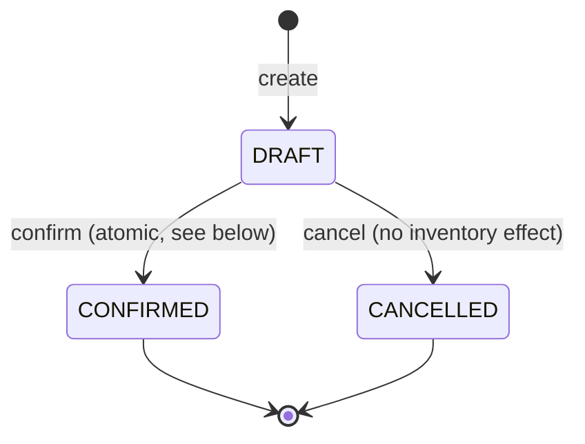
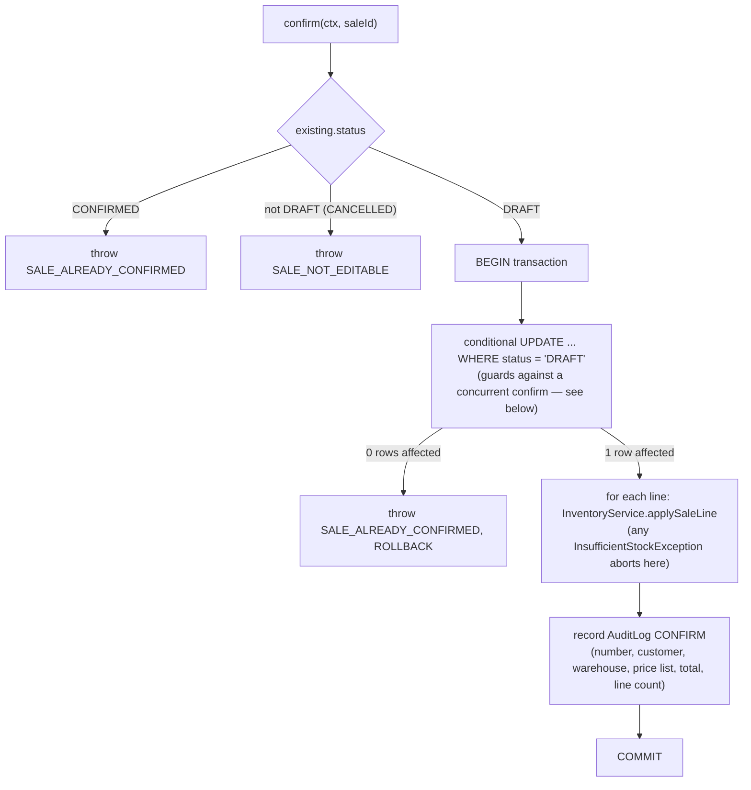

# Sales (demo core: SalesDocument, confirmation, inventory integration)

This document covers the demo Sales Core: `SalesDocument`,
`SalesDocumentLine`, `SalesDocumentSequence`, and `SalesService`. Read
this before touching `apps/api/src/sales` or Gestión's `/ventas`.

See also [pricing.md](pricing.md) (`PricingService` is the only source of
a sale line's price), [inventory.md](inventory.md) (`InventoryService` is
the only writer of `StockMovement`), [customers.md](customers.md) (the
`Customer` a sale is billed to), [authorization.md](authorization.md)
(the `sales.documents.*` permissions), [audit-architecture.md](audit-architecture.md),
and the root [CLAUDE.md](../CLAUDE.md) for the permanent rules extracted
from this doc.

## What this module is — and isn't

`SalesDocument` is **an internal ERP commercial transaction** — one
document type exists today, `SALE`. It is explicitly **not** a fiscal or
electronic invoice: no CAE, no ARCA integration, no invoice numbering, no
tax calculation. It records that a customer bought specific products at
specific prices from a specific warehouse, and — once confirmed — that
the warehouse's stock actually decreased. Nothing more.

The central design decision, stated once so every other section can rely
on it:

> **This is the one sales domain.** Facturación and a future POS mode
> will confirm sales through this same `SalesService`/`SalesDocument`
> model, not a parallel `FacturacionSale`/`PosSale` table. A fiscal
> invoice (Prompt #11) will most likely be a distinct entity that
> *references* a confirmed `SalesDocument`, not a rewrite of it.

## SalesDocument

```
tenantId, companyId, branchId (nullable)
documentType     SALE (only value today)
number           company-scoped sequence — "VTA-000001" — see "Numbering"
warehouseId      FK Warehouse — stock is decremented from here on confirm
customerId       FK Customer — must be ACTIVE at creation/update time
priceListId      FK PriceList — must be ACTIVE; caller supplies it explicitly,
                 no customer-specific default list resolution yet
currencyId       always derived from priceList.currencyId — never accepted
                 from the request body, so it can never contradict the list
status           DRAFT | CONFIRMED | CANCELLED
subtotal         sum of line netAmount (NET of line discounts, not gross)
discountTotal    sum of line discountAmount
taxTotal         always 0 — no tax engine exists yet
total            subtotal + taxTotal
notes            optional
occurredAt       business date of the sale
confirmedAt, confirmedBy, cancelledAt, cancelledBy   nullable, set on transition
createdBy
```

`companyId`/`tenantId` are never trusted from the request body — every
write derives them from the authenticated `RequestContext`, the same rule
as every other module (see CLAUDE.md).

## SalesDocumentLine

```
salesDocumentId
productVariantId
description         SNAPSHOT of the product/variant display name
quantity            NUMERIC(19,6) — always > 0, precision-checked against
                     the product's base UnitOfMeasure.decimalPlaces
unitPrice           SNAPSHOT of the price PricingService resolved
discountPercentage  0–100, default 0 — direction is implicit (always a discount)
discountAmount      gross * discountPercentage / 100
netAmount           gross - discountAmount   (gross = quantity * unitPrice, not stored)
taxAmount           always 0
totalAmount         == netAmount today (no tax to add)
```

No `tenantId`/`companyId` of its own — scoped implicitly through its
parent `salesDocument`, the same pattern already established for
`StockAdjustmentLine`/`PriceListItem`.

### The snapshot rule

`description` and `unitPrice` are resolved **once**, at the moment a line
is added or (for a DRAFT) re-priced — never re-derived from the current
`Product`/`PriceListItem` afterward, including after confirmation. If the
product is renamed or the price list changes tomorrow, a sale confirmed
today still shows exactly what the customer was actually charged. This is
the same "commercial fact, not a live pointer" reasoning as
`StockMovement` being the immutable ledger in inventory.md.

## State machine



Both `CONFIRMED` and `CANCELLED` are **terminal** — there is no
`CONFIRMED → CANCELLED` transition in this task (that would require
reversing inventory, deferred — see "Deferred"), and no
`CANCELLED → CONFIRMED` recovery. A DRAFT can be freely edited
(`PATCH`, full line replace) and cancelled; nothing about a confirmed or
cancelled sale is ever mutable through the normal API — attempting to
`PATCH`/`confirm`/`cancel` a non-DRAFT sale is rejected with
`SALE_NOT_EDITABLE` (or, specifically for a retried confirm on an
already-`CONFIRMED` sale, `SALE_ALREADY_CONFIRMED` — see "Idempotent
confirmation").

## Pricing integration

Every line's price comes from `PricingService.getPrice(companyId,
priceListId, productVariantId, occurredAt)` — `SalesService` never reads
a price from `Product`, never duplicates resolution logic, and never
accepts a client-supplied `unitPrice` (the create/update Zod schemas
don't even have that field). A price list that can't resolve a price for
a line rejects the whole request with `PRICE_NOT_FOUND` — never a
fabricated `0`.

**Repricing on the price list change.** Editing a DRAFT sale's
`priceListId` re-resolves the price for **every** line against the new
list, even if the caller didn't resend `lines` — a sale can never end up
with some lines priced against the old list and others against the new
one. Whenever `lines` *is* resent, those lines are (re-)priced fresh
regardless of whether the price list changed.

## Inventory integration

`SalesService` never mutates `InventoryBalance`/`StockMovement` directly
— it calls a new `InventoryService.applySaleLine` method (mirroring the
shape of `applyAdjustmentLine`, see inventory.md) that is:

- **Always an OUT movement** (`movementType: 'SALE'`) — unlike an
  adjustment's signed in/out, a sale line only ever removes stock in this
  task (no sales returns yet).
- **A no-op for a non-inventory-tracked line** — a `SERVICE` product (or
  any product with `trackInventory: false`) returns `null` (no
  `StockMovement`, no balance change) instead of throwing, so a mixed
  cart (e.g. "Café 1 kg" + "Servicio de instalación") confirms cleanly
  with a movement only for the tracked line.
- **Subject to the same negative-stock policy as everything else** —
  `Product.allowNegativeStock AND Warehouse.allowNegativeStock`; when
  either is false, a sale that would drive `onHand` negative is rejected
  with `INSUFFICIENT_STOCK`.

`StockMovement.referenceType = 'SalesDocument'`,
`referenceId = salesDocument.id` — the same "who caused this movement"
convention documented in inventory.md, letting a confirmed sale's
inventory effect be found later (`GET /inventory/movements?referenceType=SalesDocument`)
without a dedicated join table.

### DRAFT has zero inventory effect

Creating or editing a DRAFT sale never touches `InventoryBalance` or
`StockMovement` — only `confirm()` does. Adding a line for qty 3 to a
DRAFT, or even saving/reloading it several times, leaves `onHand`
untouched.

## Confirmation is atomic

`confirm()` runs entirely inside one `prisma.$transaction`:



Any failure at any step — one line has insufficient stock, a variant was
deactivated mid-flight, anything — rolls back the **entire** transaction:
no partial `StockMovement` for the lines that *were* valid, no status
change, no audit record. The sale is exactly as it was before the confirm
attempt (`DRAFT`, unchanged lines).

### Idempotent confirmation

The status transition is a **conditional update**
(`UPDATE ... WHERE id = ? AND status = 'DRAFT'`) done **first**, inside
the transaction, before any inventory line is touched. This makes confirm
safe under both a sequential retry and a genuine concurrent race:

- **Sequential retry** (the common case — a client retries after a
  timeout, or a user double-clicks "Confirmar venta"): the second call
  loads a sale that's already `CONFIRMED` and returns
  `SALE_ALREADY_CONFIRMED` before the transaction even starts.
- **Concurrent race** (two confirms in flight at once): Postgres
  serializes the two `UPDATE ... WHERE status = 'DRAFT'` statements at
  the row level. Whichever commits first wins; the second one's `WHERE`
  clause now matches zero rows, so it throws
  `SALE_ALREADY_CONFIRMED` and rolls back **before** calling
  `applySaleLine` for any line — stock is deducted exactly once, never
  twice, even under a race, not only under sequential retries.

## Numbering

Same concurrency-safe pattern as `StockAdjustment` (inventory.md):
`SalesDocumentSequence` is a one-row-per-company atomic counter
(`upsert({ update: { lastValue: { increment: 1 } } })` inside the create
transaction), formatted as `` `VTA-${String(lastValue).padStart(6, '0')}` ``
— e.g. `VTA-000001`. Never `MAX(number) + 1`, which would race under
concurrent creates.

## Customer / warehouse / price list validation

- **Customer** must belong to the company and be `ACTIVE`
  (`SALE_CUSTOMER_INACTIVE` otherwise) — no customer account/credit
  balance exists yet (see "Deferred").
- **Warehouse** must belong to the company, be `ACTIVE`, and have
  `allowsSales = true` (`SALE_WAREHOUSE_INVALID` otherwise). Branch
  matching is only enforced **when the sale actually carries a
  `branchId`**: a warehouse with `branchId = null` is valid for any
  branch; a warehouse with a set `branchId` must match the sale's
  `branchId` exactly. Gestión has no branch-scoped session today (unlike
  Facturación's `WarehouseSelector`), so most sales created there never
  carry a `branchId` at all — in that case any active, sales-enabled
  warehouse is valid, matching every other Gestión module's warehouse
  dropdown (see `StockAdjustmentsService`).
- **Price list** must belong to the company and be `active`
  (`SALE_PRICE_LIST_INVALID` otherwise). No customer-specific price list
  selection exists — the caller always supplies `priceListId` explicitly.

## Totals convention

Chosen once, applied consistently everywhere (service, API response,
Gestión UI):

```
line:     gross    = quantity * unitPrice            (not stored)
          discount  = gross * discountPercentage / 100
          net       = gross - discount
          tax       = 0
          total     = net

document: subtotal      = sum(line.net)     — NET of discounts, not gross
          discountTotal = sum(line.discount)
          taxTotal      = 0
          total         = subtotal + taxTotal
```

All arithmetic uses `Prisma.Decimal`, never a JS `number`/float.
`discountPercentage` rounds to 2 decimal places; money fields round to 4
decimal places, both `ROUND_HALF_UP` — the same rounding discipline as
pricing.md.

## Company isolation

Same rule as every other module: a `SalesDocument` from Company A must
never appear, be readable, or be actionable from Company B. Every service
method is scoped by `companyId`, and every lookup is
`findFirst({ where: { id, companyId } })` — never `findUnique({ where: { id } })`
alone, so a cross-company id reads as a plain 404, never distinguishing
"doesn't exist" from "not yours."

## Permissions

```
sales.documents.read
sales.documents.create
sales.documents.update
sales.documents.confirm
sales.documents.cancel
```

Distinct from the `sales.orders.*`/`sales.invoices.*` codes already
registered in the permission catalog for future Pedido de Venta / fiscal
Factura concepts — those remain unimplemented placeholders; these five
are the ones this task's `SalesDocument` actually checks.

Default role grants: ADMIN (Administrador) gets everything. MANAGER
(Gerente) gets all five. SALES (Ventas) gets
`read/create/update/confirm` — deliberately **not** `cancel`, so
abandoning a draft sale requires a manager. VIEWER (Solo lectura) gets
`read`. WAREHOUSE (Depósito) also gets `read` — a warehouse operator
benefits from seeing what will (or did) decrement their stock, even
without being able to sell.

## Audit

- `CREATE` — on `SalesDocument`, `after: { number, customerId,
  warehouseId, total, status }`.
- `UPDATE` (DRAFT edit) — minimal `metadata: { change: 'draft_updated' }`,
  no per-field diff (same minimal pattern as
  `StockAdjustmentsService.update`, not the full before/after diff used
  for master-data records like `Warehouse`).
- `CONFIRM` — one meaningful event per confirmation, never per-line
  noise: `metadata: { change: 'sale_confirmed', number, customerName,
  warehouseName, priceListName, total, lineCount }`.
- `CANCEL` (DRAFT only) — `metadata: { number }`.

`StockMovement` (the inventory ledger) and `AuditLog` (who did what) stay
separate concepts, same as every other module: confirming a sale
produces **both** the `StockMovement` row(s) *and* the `CONFIRM` audit
event, and neither replaces the other.

## API

All routes are company-scoped (never trust `companyId`/`tenantId` from
the request body).

| Method | Path | Permission | Notes |
| --- | --- | --- | --- |
| GET | `/sales` | `sales.documents.read` | paginated; filters: search (number + customer name/code), status, customerId, warehouseId, dateFrom, dateTo |
| GET | `/sales/:id` | `sales.documents.read` | |
| POST | `/sales` | `sales.documents.create` | creates a DRAFT |
| PATCH | `/sales/:id` | `sales.documents.update` | DRAFT only — `SALE_NOT_EDITABLE` otherwise |
| POST | `/sales/:id/confirm` | `sales.documents.confirm` | DRAFT only, transactional, idempotent |
| POST | `/sales/:id/cancel` | `sales.documents.cancel` | DRAFT only, no inventory effect |

Confirmed-sale reversal (a `POST /sales/:id/reverse` or similar) is
explicitly **not implemented** — see "Deferred".

## Gestión

A **Ventas** entry sits in the sidebar (only shown to
`sales.documents.read`), pointing at a single flat operations area — no
Pedidos/Facturas/Remitos submenu scaffolding for concepts that don't
exist yet.

- **`/ventas`** — Número/Fecha/Cliente/Depósito/Lista/Total/Estado, with
  search + depósito + estado filters, "Nueva venta" primary action.
- **`/ventas/nueva`** — select cliente (search-as-you-type
  `CustomerPicker`, ACTIVE customers only), depósito, lista de precios;
  add lines through `VariantPicker` (the same inventory-aware picker
  `StockAdjustment` uses, with `allowServices` on so SERVICE products are
  selectable here — unlike an adjustment, a sale can legitimately include
  one). Each line shows quantity, descuento %, the **live** resolved
  price (`usePriceLookup`) and **live** warehouse availability
  (`useVariantStock`) — a price-lookup failure shows "Sin precio", never
  a fabricated `$0`; availability while loading shows "Cargando…", never
  a fabricated `0`. Saves as a draft (`POST /sales`).
- **`/ventas/:id`** — read-only detail: status, number, date, customer,
  warehouse, price list, lines with unit price/discount/line total,
  document totals. DRAFT sales show **Editar** (→
  `/ventas/:id/editar`, the same line-editing UI as "nueva"),
  **Confirmar venta** (confirmation copy: "Esta operación descontará
  stock del depósito seleccionado.", not an alarming dialog), and
  **Cancelar borrador**. A CONFIRMED sale shows a "Ver movimientos de
  stock" link (`/stock/movimientos?warehouseId=...&referenceType=SalesDocument`)
  and no edit controls at all — nothing on a confirmed or cancelled sale
  is ever editable through the UI, matching the backend's terminal-state
  rule.

`Producto` and `Cliente` detail pages do **not** gain a sales tab in this
task — kept out of scope per the task's own instruction to stay focused.

## Facturación / future POS

This task does **not** implement a Facturación sales UI — that's a later
task. Facturación will call the **same** `SalesService` methods this
document describes (create/confirm/cancel a `SalesDocument`), not a
parallel implementation; POS mode will do the same. Facturación remains
visually unchanged by this task.

## Deferred

Out of scope for this task, intentionally: customer account
movements/receivables/balance/credit, payment methods and collections,
fiscal invoices (ARCA/CAE/invoice numbering), credit notes, debit notes,
delivery notes, sales quotes, sales orders, a customer account ledger,
accounts receivable, payment terms, credit limit enforcement, salesperson
commissions, a POS UI/cash register/card processing, promotions,
customer-specific pricing, tax/VAT calculation, accounting entries,
profitability/margin display, sales returns, and reversing a confirmed
sale's inventory effect (a `CONFIRMED → CANCELLED` transition does not
exist — correcting a confirmed sale requires a future credit-note-style
mechanism, not implemented here, the same "no reversal in this task"
decision already made for `StockAdjustment`).
